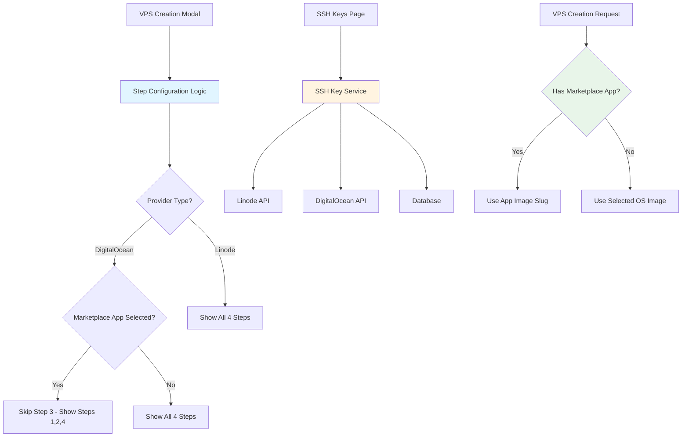

# Design Document

## Overview

This design addresses critical issues in the DigitalOcean VPS creation workflow by implementing conditional step logic, per-user SSH key filtering, and a dedicated SSH key management interface. The solution involves modifying the VPS creation modal to dynamically skip the OS selection step when a marketplace app is selected, implementing user-scoped SSH key queries, and creating a new `/ssh-keys` page for cross-provider key management.

The key architectural changes include:
1. Dynamic step configuration based on provider type and marketplace app selection
2. Backend API modifications to filter SSH keys by user
3. New SSH key management page with dual-provider synchronization
4. Updated VPS creation request handling to properly support marketplace apps

## Architecture

### System Components



### Data Flow

#### 1. VPS Creation with Marketplace App

```
User selects DigitalOcean provider
  → Step 1: Plan & Label
  → Step 2: Marketplace Apps (user selects app)
  → System sets appSlug and appData in form
  → Step configuration detects marketplace app
  → Step 3 (OS Selection) is skipped
  → Step 4 becomes Step 3 in UI
  → User completes configuration
  → Backend receives appSlug in request
  → Backend uses app's image slug for Droplet creation
  → DigitalOcean provisions VPS with marketplace app
```


#### 2. SSH Key Filtering

```
User opens VPS creation modal
  → Frontend requests SSH keys from /api/ssh-keys
  → Backend queries database with user_id filter
  → Backend fetches keys from Linode API (filtered by user)
  → Backend fetches keys from DigitalOcean API (filtered by user)
  → Backend returns only user's keys
  → Frontend displays filtered keys in configuration step
```

#### 3. SSH Key Management

```
User navigates to /ssh-keys page
  → Frontend fetches user's SSH keys
  → User clicks "Add SSH Key"
  → User enters key name and public key
  → Backend validates key format
  → Backend adds key to Linode account
  → Backend adds key to DigitalOcean account
  → Backend stores key in database with provider IDs
  → Frontend refreshes key list
```

## Components and Interfaces

### Frontend Components

#### 1. VPS.tsx - Step Configuration

**New Function: `getActiveSteps()`**

```typescript
const getActiveSteps = (
  providerType: ProviderType,
  hasMarketplaceApp: boolean
): Array<StepConfig> => {
  const allSteps = [
    {
      id: "plan",
      title: "Plan & Label",
      description: "Configure the server label and pricing plan.",
      content: /* ... */
    },
    {
      id: "deployments",
      title: providerType === "digitalocean" ? "Marketplace Apps" : "1-Click Deployments",
      description: /* ... */,
      content: /* ... */
    },
    {
      id: "os",
      title: "Operating System",
      description: "Pick the base operating system for this VPS.",
      content: /* ... */,
      skip: providerType === "digitalocean" && hasMarketplaceApp
    },
    {
      id: "finalize",
      title: "Finalize & Review",
      description: "Set credentials and optional add-ons.",
      content: /* ... */
    }
  ];

  return allSteps.filter(step => !step.skip);
};
```


**Modified State Management**

```typescript
// Add computed value for active steps
const activeSteps = useMemo(() => {
  const hasMarketplaceApp = Boolean(
    createForm.provider_type === "digitalocean" && createForm.appSlug
  );
  return getActiveSteps(createForm.provider_type, hasMarketplaceApp);
}, [createForm.provider_type, createForm.appSlug]);

// Update totalSteps to be dynamic
const totalSteps = activeSteps.length;

// Update step navigation
const handleNext = () => {
  const currentIndex = activeSteps.findIndex(s => s.id === currentStepId);
  if (currentIndex < activeSteps.length - 1) {
    setCurrentStepId(activeSteps[currentIndex + 1].id);
  }
};

const handleBack = () => {
  const currentIndex = activeSteps.findIndex(s => s.id === currentStepId);
  if (currentIndex > 0) {
    setCurrentStepId(activeSteps[currentIndex - 1].id);
  }
};
```

#### 2. DigitalOceanMarketplace.tsx - App Selection

**Modified `onSelect` Handler**

```typescript
const handleAppSelect = (app: MarketplaceApp) => {
  // Pass both slug and full app data
  onSelect(app.slug, app);
};

const handleNoneSelect = () => {
  // Clear both slug and app data
  onSelect(null, null);
};
```

#### 3. New Component: SSHKeysPage.tsx

**Component Structure**

```typescript
interface SSHKey {
  id: string;
  label: string;
  public_key: string;
  fingerprint: string;
  linode_id?: number;
  digitalocean_id?: number;
  created_at: string;
  user_id: string;
}

const SSHKeysPage: React.FC = () => {
  const [keys, setKeys] = useState<SSHKey[]>([]);
  const [loading, setLoading] = useState(true);
  const [showAddModal, setShowAddModal] = useState(false);
  const [deleteModal, setDeleteModal] = useState<{
    open: boolean;
    key: SSHKey | null;
  }>({ open: false, key: null });

  // Fetch user's SSH keys
  const fetchKeys = async () => { /* ... */ };

  // Add new SSH key
  const handleAddKey = async (label: string, publicKey: string) => { /* ... */ };

  // Delete SSH key
  const handleDeleteKey = async (keyId: string) => { /* ... */ };

  return (
    <div className="space-y-6">
      <div className="flex justify-between items-center">
        <h1>SSH Keys</h1>
        <Button onClick={() => setShowAddModal(true)}>Add SSH Key</Button>
      </div>

      <Card>
        <CardContent>
          {keys.map(key => (
            <SSHKeyCard key={key.id} sshKey={key} onDelete={handleDeleteKey} />
          ))}
        </CardContent>
      </Card>

      <AddSSHKeyModal
        open={showAddModal}
        onClose={() => setShowAddModal(false)}
        onAdd={handleAddKey}
      />
    </div>
  );
};
```


### Backend Services

#### 1. SSH Key Service (api/services/sshKeyService.ts)

**New Service Methods**

```typescript
class SSHKeyService {
  /**
   * Get all SSH keys for a specific user
   */
  async getUserSSHKeys(userId: string): Promise<SSHKey[]> {
    const result = await query(
      `SELECT * FROM ssh_keys WHERE user_id = $1 ORDER BY created_at DESC`,
      [userId]
    );
    return result.rows;
  }

  /**
   * Add SSH key to both providers and database
   */
  async addSSHKey(
    userId: string,
    label: string,
    publicKey: string
  ): Promise<{
    success: boolean;
    key?: SSHKey;
    errors?: { linode?: string; digitalocean?: string };
  }> {
    const results = {
      linodeId: null as number | null,
      digitaloceanId: null as number | null,
      errors: {} as any
    };

    // Add to Linode
    try {
      const linodeKey = await linodeService.addSSHKey(label, publicKey);
      results.linodeId = linodeKey.id;
    } catch (error) {
      results.errors.linode = error.message;
    }

    // Add to DigitalOcean
    try {
      const doKey = await digitalOceanService.addSSHKey(label, publicKey);
      results.digitaloceanId = doKey.id;
    } catch (error) {
      results.errors.digitalocean = error.message;
    }

    // Store in database
    const dbResult = await query(
      `INSERT INTO ssh_keys (user_id, label, public_key, linode_id, digitalocean_id)
       VALUES ($1, $2, $3, $4, $5) RETURNING *`,
      [userId, label, publicKey, results.linodeId, results.digitaloceanId]
    );

    return {
      success: true,
      key: dbResult.rows[0],
      errors: Object.keys(results.errors).length > 0 ? results.errors : undefined
    };
  }

  /**
   * Delete SSH key from both providers and database
   */
  async deleteSSHKey(userId: string, keyId: string): Promise<{
    success: boolean;
    errors?: { linode?: string; digitalocean?: string };
  }> {
    // Get key details
    const keyResult = await query(
      `SELECT * FROM ssh_keys WHERE id = $1 AND user_id = $2`,
      [keyId, userId]
    );

    if (keyResult.rows.length === 0) {
      throw new Error('SSH key not found');
    }

    const key = keyResult.rows[0];
    const errors = {} as any;

    // Delete from Linode
    if (key.linode_id) {
      try {
        await linodeService.deleteSSHKey(key.linode_id);
      } catch (error) {
        errors.linode = error.message;
      }
    }

    // Delete from DigitalOcean
    if (key.digitalocean_id) {
      try {
        await digitalOceanService.deleteSSHKey(key.digitalocean_id);
      } catch (error) {
        errors.digitalocean = error.message;
      }
    }

    // Delete from database
    await query(`DELETE FROM ssh_keys WHERE id = $1`, [keyId]);

    return {
      success: true,
      errors: Object.keys(errors).length > 0 ? errors : undefined
    };
  }
}
```


#### 2. API Routes (api/routes/sshKeys.ts)

**New Route Handlers**

```typescript
// GET /api/ssh-keys - Get user's SSH keys
router.get('/', authenticateToken, async (req: Request, res: Response) => {
  try {
    const userId = req.user.id;
    const keys = await sshKeyService.getUserSSHKeys(userId);
    res.json({ keys });
  } catch (error) {
    console.error('Failed to fetch SSH keys:', error);
    res.status(500).json({ error: 'Failed to fetch SSH keys' });
  }
});

// POST /api/ssh-keys - Add new SSH key
router.post('/', authenticateToken, async (req: Request, res: Response) => {
  try {
    const userId = req.user.id;
    const { label, public_key } = req.body;

    if (!label || !public_key) {
      return res.status(400).json({ error: 'Label and public key are required' });
    }

    const result = await sshKeyService.addSSHKey(userId, label, public_key);

    if (result.errors) {
      return res.status(207).json({
        success: true,
        key: result.key,
        warnings: result.errors,
        message: 'SSH key added with some warnings'
      });
    }

    res.status(201).json({
      success: true,
      key: result.key,
      message: 'SSH key added successfully'
    });
  } catch (error) {
    console.error('Failed to add SSH key:', error);
    res.status(500).json({ error: 'Failed to add SSH key' });
  }
});

// DELETE /api/ssh-keys/:id - Delete SSH key
router.delete('/:id', authenticateToken, async (req: Request, res: Response) => {
  try {
    const userId = req.user.id;
    const keyId = req.params.id;

    const result = await sshKeyService.deleteSSHKey(userId, keyId);

    if (result.errors) {
      return res.json({
        success: true,
        warnings: result.errors,
        message: 'SSH key deleted with some warnings'
      });
    }

    res.json({
      success: true,
      message: 'SSH key deleted successfully'
    });
  } catch (error) {
    console.error('Failed to delete SSH key:', error);
    res.status(500).json({ error: 'Failed to delete SSH key' });
  }
});
```


#### 3. VPS Creation Route Modification (api/routes/vps.ts)

**Updated VPS Creation Handler**

```typescript
router.post('/', authenticateToken, async (req: Request, res: Response) => {
  try {
    const {
      provider_type,
      appSlug,
      appData,
      image,
      // ... other fields
    } = req.body;

    if (provider_type === 'digitalocean') {
      // DigitalOcean VPS creation
      const createParams: any = {
        name: label,
        region: region,
        size: type,
        // ... other params
      };

      // If marketplace app is selected, use app slug instead of image
      if (appSlug) {
        createParams.image = appSlug; // Use marketplace app slug as image
        // Don't include separate OS image parameter
      } else if (image) {
        createParams.image = image; // Use selected OS image
      }

      // Add SSH keys (filtered by user)
      if (sshKeys && sshKeys.length > 0) {
        const userKeys = await sshKeyService.getUserSSHKeys(req.user.id);
        const validKeyIds = userKeys
          .filter(k => sshKeys.includes(k.id))
          .map(k => k.digitalocean_id)
          .filter(id => id !== null);
        
        if (validKeyIds.length > 0) {
          createParams.ssh_keys = validKeyIds;
        }
      }

      const droplet = await digitalOceanService.createDigitalOceanDroplet(
        apiToken,
        createParams
      );

      // ... rest of creation logic
    }
  } catch (error) {
    // ... error handling
  }
});
```


## Data Models

### SSH Key Database Schema

```sql
CREATE TABLE IF NOT EXISTS ssh_keys (
  id UUID PRIMARY KEY DEFAULT uuid_generate_v4(),
  user_id UUID NOT NULL REFERENCES users(id) ON DELETE CASCADE,
  label VARCHAR(255) NOT NULL,
  public_key TEXT NOT NULL,
  fingerprint VARCHAR(255),
  linode_id INTEGER,
  digitalocean_id INTEGER,
  created_at TIMESTAMP WITH TIME ZONE DEFAULT NOW(),
  updated_at TIMESTAMP WITH TIME ZONE DEFAULT NOW(),
  UNIQUE(user_id, label)
);

CREATE INDEX idx_ssh_keys_user_id ON ssh_keys(user_id);
CREATE INDEX idx_ssh_keys_linode_id ON ssh_keys(linode_id);
CREATE INDEX idx_ssh_keys_digitalocean_id ON ssh_keys(digitalocean_id);
```

### TypeScript Interfaces

```typescript
// SSH Key interface
interface SSHKey {
  id: string;
  user_id: string;
  label: string;
  public_key: string;
  fingerprint?: string;
  linode_id?: number;
  digitalocean_id?: number;
  created_at: string;
  updated_at: string;
}

// Step configuration interface
interface StepConfig {
  id: string;
  title: string;
  description: string;
  content: React.ReactNode;
  skip?: boolean;
}

// Updated CreateVPSForm interface
interface CreateVPSForm {
  provider_id: string;
  provider_type: ProviderType;
  label: string;
  type: string;
  region: string;
  image: string;
  rootPassword: string;
  sshKeys: string[]; // Array of SSH key IDs (user's keys only)
  backups: boolean;
  privateIP: boolean;
  appSlug?: string | null; // DigitalOcean marketplace app slug
  appData?: MarketplaceApp | null; // Full marketplace app data
}
```


## Error Handling

### Frontend Error Scenarios

1. **SSH Key Addition Partial Failure**
   - Display: Warning toast with details about which provider failed
   - Message: "SSH key added to [successful providers], but failed for [failed providers]"
   - Action: Key is still usable for successful providers

2. **SSH Key Deletion Partial Failure**
   - Display: Warning toast with provider-specific errors
   - Message: "SSH key removed from database, but failed to delete from [failed providers]"
   - Action: Manual cleanup may be required

3. **Invalid SSH Key Format**
   - Display: Error message in add key modal
   - Message: "Invalid SSH public key format. Please check your key."
   - Action: User must correct the key format

4. **Step Navigation with Unsaved Changes**
   - Display: Confirmation dialog
   - Message: "You have unsaved changes. Save before continuing?"
   - Action: User can save or discard changes

### Backend Error Scenarios

1. **Provider API Failure During Key Addition**
   - Thrown by: `sshKeyService.addSSHKey()`
   - HTTP Status: 207 Multi-Status
   - Response: Includes key data and provider-specific errors

2. **Unauthorized SSH Key Access**
   - Thrown by: SSH key routes
   - HTTP Status: 403 Forbidden
   - Response: `{ error: "Access denied to SSH key" }`

3. **Missing Marketplace App Image**
   - Thrown by: VPS creation route
   - HTTP Status: 400 Bad Request
   - Response: `{ error: "Marketplace app requires image slug" }`

4. **Invalid VPS Configuration**
   - Thrown by: VPS creation route
   - HTTP Status: 422 Unprocessable Entity
   - Response: `{ error: "Invalid configuration for marketplace app deployment" }`


## Testing Strategy

### Unit Tests

1. **Step Configuration Logic**
   - Test `getActiveSteps()` with DigitalOcean + marketplace app (should return 3 steps)
   - Test `getActiveSteps()` with DigitalOcean + no app (should return 4 steps)
   - Test `getActiveSteps()` with Linode (should always return 4 steps)
   - Test step navigation with skipped steps

2. **SSH Key Service**
   - Test `getUserSSHKeys()` filters by user ID
   - Test `addSSHKey()` handles partial provider failures
   - Test `deleteSSHKey()` handles partial provider failures
   - Test unauthorized access attempts

3. **VPS Creation Logic**
   - Test marketplace app image slug is used correctly
   - Test OS image is used when no marketplace app
   - Test SSH key filtering by user

### Integration Tests

1. **VPS Creation Flow**
   - Test complete flow with marketplace app selection
   - Test complete flow without marketplace app
   - Test switching between marketplace app and no app
   - Test provider switching clears marketplace app

2. **SSH Key Management**
   - Test adding SSH key to both providers
   - Test deleting SSH key from both providers
   - Test fetching only user's keys
   - Test SSH key usage in VPS creation

3. **API Routes**
   - Test GET /api/ssh-keys returns only user's keys
   - Test POST /api/ssh-keys creates key in both providers
   - Test DELETE /api/ssh-keys/:id removes key from both providers
   - Test POST /api/vps with marketplace app

### Manual Testing

1. **VPS Creation with Marketplace App**
   - Select DigitalOcean provider
   - Select a marketplace app (e.g., WordPress)
   - Verify step 3 (OS) is skipped
   - Verify step numbering shows "Step 3 of 3" for finalization
   - Complete creation and verify VPS is provisioned correctly

2. **VPS Creation without Marketplace App**
   - Select DigitalOcean provider
   - Select "None" for marketplace apps
   - Verify step 3 (OS) is shown
   - Verify step numbering shows "Step 4 of 4" for finalization
   - Complete creation and verify VPS is provisioned correctly

3. **SSH Key Management**
   - Navigate to /ssh-keys page
   - Add a new SSH key
   - Verify key appears in both Linode and DigitalOcean accounts
   - Create a VPS and verify the key is available for selection
   - Delete the key and verify it's removed from both providers

4. **SSH Key Filtering**
   - Create VPS as User A
   - Verify only User A's SSH keys are shown
   - Login as User B
   - Verify only User B's SSH keys are shown


## Migration Notes

### Database Migration

**New Migration: `018_ssh_keys_table.sql`**

```sql
-- Create ssh_keys table for user-scoped SSH key management
CREATE TABLE IF NOT EXISTS ssh_keys (
  id UUID PRIMARY KEY DEFAULT uuid_generate_v4(),
  user_id UUID NOT NULL REFERENCES users(id) ON DELETE CASCADE,
  label VARCHAR(255) NOT NULL,
  public_key TEXT NOT NULL,
  fingerprint VARCHAR(255),
  linode_id INTEGER,
  digitalocean_id INTEGER,
  created_at TIMESTAMP WITH TIME ZONE DEFAULT NOW(),
  updated_at TIMESTAMP WITH TIME ZONE DEFAULT NOW(),
  UNIQUE(user_id, label)
);

CREATE INDEX idx_ssh_keys_user_id ON ssh_keys(user_id);
CREATE INDEX idx_ssh_keys_linode_id ON ssh_keys(linode_id);
CREATE INDEX idx_ssh_keys_digitalocean_id ON ssh_keys(digitalocean_id);

-- Add trigger for updated_at
CREATE TRIGGER update_ssh_keys_updated_at
  BEFORE UPDATE ON ssh_keys
  FOR EACH ROW
  EXECUTE FUNCTION update_updated_at_column();
```

### Backward Compatibility

- Existing VPS creation flow for Linode remains unchanged (all 4 steps)
- Existing DigitalOcean VPS creation without marketplace apps remains unchanged
- SSH key filtering is additive - no breaking changes to existing functionality
- New `/ssh-keys` route is additive - doesn't affect existing routes

### Deployment Steps

1. Run database migration to create `ssh_keys` table
2. Deploy backend changes (SSH key service, routes, VPS creation logic)
3. Deploy frontend changes (step configuration, SSH keys page, marketplace handling)
4. Test VPS creation with marketplace apps
5. Test SSH key management functionality
6. Monitor error logs for any issues

### Rollback Plan

If issues arise:
1. Revert frontend changes to restore original 4-step flow
2. Revert backend VPS creation logic to ignore marketplace app slug
3. Disable `/ssh-keys` route if SSH key management has issues
4. Database migration can remain (table is additive, not breaking)


## Security Considerations

### SSH Key Access Control

1. **User Isolation**
   - All SSH key queries MUST filter by authenticated user ID
   - Attempting to access another user's SSH keys returns 403 Forbidden
   - SSH key IDs are UUIDs to prevent enumeration attacks

2. **Provider API Token Security**
   - Provider API tokens are stored encrypted in database
   - Tokens are never exposed in API responses
   - SSH key operations use server-side provider credentials

3. **SSH Key Validation**
   - Public keys are validated for correct format before storage
   - Invalid keys are rejected with clear error messages
   - Fingerprints are calculated and stored for verification

### VPS Creation Security

1. **Marketplace App Validation**
   - Marketplace app slugs are validated against DigitalOcean's catalog
   - Invalid app slugs are rejected before VPS creation
   - App data is sanitized before storage

2. **SSH Key Authorization**
   - Only user's own SSH keys can be attached to VPS instances
   - SSH key IDs are validated against user's key list
   - Invalid or unauthorized key IDs are filtered out

3. **Rate Limiting**
   - SSH key operations are rate-limited per user
   - VPS creation is rate-limited per organization
   - Provider API calls are rate-limited to prevent abuse

## Performance Considerations

### Frontend Optimizations

1. **Step Configuration Memoization**
   - `getActiveSteps()` result is memoized based on provider type and marketplace app
   - Prevents unnecessary re-renders during step navigation
   - Step content is lazy-loaded where possible

2. **SSH Key Caching**
   - SSH keys are fetched once and cached in component state
   - Cache is invalidated after add/delete operations
   - Reduces API calls during VPS creation flow

### Backend Optimizations

1. **Database Queries**
   - SSH key queries use indexed user_id column
   - Batch operations for multi-provider key management
   - Connection pooling for concurrent requests

2. **Provider API Calls**
   - SSH key operations are parallelized across providers
   - Failures in one provider don't block the other
   - Timeout handling prevents hanging requests

3. **Caching Strategy**
   - Provider SSH keys can be cached with short TTL
   - Marketplace app catalog can be cached
   - Cache invalidation on key add/delete operations

