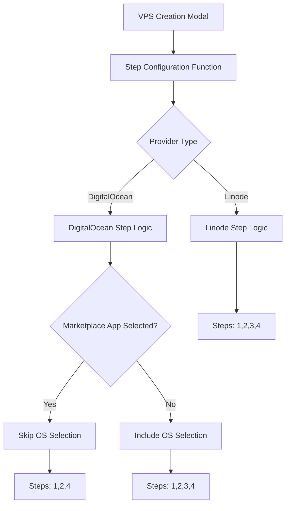
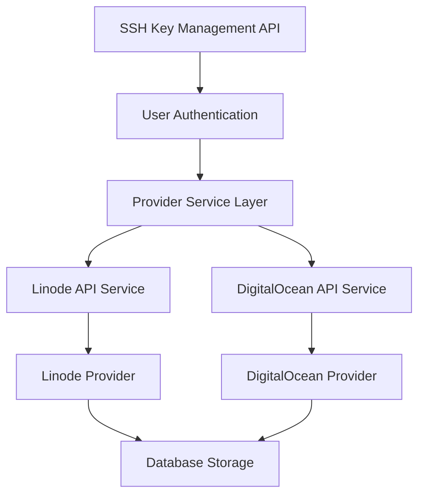

# Design Document

## Overview

This design document outlines the implementation approach for enhancing the DigitalOcean VPS creation workflow with conditional step logic, per-user SSH key filtering, and a dedicated SSH key management interface. The solution addresses three critical issues: marketplace app deployment failures due to forced OS selection, security concerns with global SSH key visibility, and lack of centralized SSH key management across providers.

The design follows a modular approach that maintains backward compatibility with existing Linode workflows while introducing provider-specific conditional logic for DigitalOcean. The implementation leverages existing component patterns and API structures to minimize disruption to the current codebase.

## Architecture

### Frontend Architecture

The frontend architecture centers around a conditional step configuration system that dynamically determines which steps to display based on provider type and user selections. This approach maintains the existing multi-step wizard pattern while introducing flexibility for provider-specific workflows.



### Backend Architecture

The backend architecture extends existing API endpoints with user-based filtering and introduces new SSH key management endpoints that coordinate operations across multiple cloud providers.



## Components and Interfaces

### Step Configuration System

**StepConfiguration Interface**
```typescript
interface StepConfiguration {
  stepNumber: number;
  isActive: boolean;
  component: React.ComponentType;
  title: string;
  description: string;
}

interface StepConfigurationOptions {
  providerType: ProviderType;
  hasMarketplaceApp: boolean;
  formData: Partial<CreateVPSForm>;
}
```

**Step Configuration Function**
The core logic for determining active steps based on provider and form state:

```typescript
function getActiveSteps(options: StepConfigurationOptions): StepConfiguration[] {
  const { providerType, hasMarketplaceApp } = options;
  
  const baseSteps = [
    { stepNumber: 1, title: "Provider & Plan", isActive: true },
    { stepNumber: 2, title: "Marketplace/StackScript", isActive: true }
  ];
  
  if (providerType === 'digitalocean' && hasMarketplaceApp) {
    return [
      ...baseSteps,
      { stepNumber: 3, title: "Finalize & Review", isActive: true }
    ];
  }
  
  return [
    ...baseSteps,
    { stepNumber: 3, title: "Operating System", isActive: true },
    { stepNumber: 4, title: "Finalize & Review", isActive: true }
  ];
}
```

### Enhanced VPS Creation Modal

**Modal State Management**
The modal maintains enhanced state to track step configuration and navigation:

```typescript
interface VPSCreationModalState {
  currentStep: number;
  activeSteps: StepConfiguration[];
  formData: CreateVPSForm;
  navigationHistory: number[];
}
```

**Navigation Logic**
Enhanced navigation that respects conditional step logic:

```typescript
const handleStepNavigation = (direction: 'next' | 'back') => {
  const activeStepNumbers = activeSteps.map(step => step.stepNumber);
  const currentIndex = activeStepNumbers.indexOf(currentStep);
  
  if (direction === 'next' && currentIndex < activeStepNumbers.length - 1) {
    setCurrentStep(activeStepNumbers[currentIndex + 1]);
  } else if (direction === 'back' && currentIndex > 0) {
    setCurrentStep(activeStepNumbers[currentIndex - 1]);
  }
};
```

### SSH Key Management Components

**SSH Key Management Page**
A dedicated page component for managing SSH keys across providers:

```typescript
interface SSHKeyManagementPageProps {
  user: User;
}

interface SSHKeyWithProviders {
  id: string;
  name: string;
  publicKey: string;
  fingerprint: string;
  createdAt: string;
  providers: {
    linode?: { id: string; status: 'active' | 'error' };
    digitalocean?: { id: number; status: 'active' | 'error' };
  };
}
```

**SSH Key Form Component**
A reusable form for adding new SSH keys:

```typescript
interface SSHKeyFormProps {
  onSubmit: (data: { name: string; publicKey: string }) => Promise<void>;
  isLoading: boolean;
}
```

### Enhanced SSH Key Filtering

**User-Filtered SSH Key Service**
Backend service that filters SSH keys by user ownership:

```typescript
interface UserSSHKeyFilter {
  userId: string;
  providerType: ProviderType;
}

interface FilteredSSHKeyResponse {
  keys: SSHKey[];
  total: number;
  userOwned: number;
}
```

## Data Models

### Enhanced SSH Key Model

**Database Schema Extension**
```sql
-- Extend existing ssh_keys table or create new user_ssh_keys table
CREATE TABLE user_ssh_keys (
  id SERIAL PRIMARY KEY,
  user_id INTEGER REFERENCES users(id) ON DELETE CASCADE,
  name VARCHAR(255) NOT NULL,
  public_key TEXT NOT NULL,
  fingerprint VARCHAR(255) NOT NULL,
  linode_key_id VARCHAR(50),
  digitalocean_key_id INTEGER,
  created_at TIMESTAMP DEFAULT CURRENT_TIMESTAMP,
  updated_at TIMESTAMP DEFAULT CURRENT_TIMESTAMP,
  UNIQUE(user_id, fingerprint)
);

-- Index for efficient user-based queries
CREATE INDEX idx_user_ssh_keys_user_id ON user_ssh_keys(user_id);
CREATE INDEX idx_user_ssh_keys_fingerprint ON user_ssh_keys(fingerprint);
```

**TypeScript Interface**
```typescript
interface UserSSHKey {
  id: string;
  userId: string;
  name: string;
  publicKey: string;
  fingerprint: string;
  linodeKeyId?: string;
  digitaloceanKeyId?: number;
  createdAt: string;
  updatedAt: string;
  providers: {
    linode: { id?: string; status: 'active' | 'error' | 'pending' };
    digitalocean: { id?: number; status: 'active' | 'error' | 'pending' };
  };
}
```

### Enhanced VPS Form Model

**Extended CreateVPSForm**
The existing form model already supports the required fields, but we'll enhance validation:

```typescript
interface CreateVPSFormValidation {
  validateMarketplaceAppSelection(formData: CreateVPSForm): ValidationResult;
  validateConditionalFields(formData: CreateVPSForm): ValidationResult;
  validateSSHKeyOwnership(userId: string, sshKeys: string[]): Promise<ValidationResult>;
}
```

## Error Handling

### Step Navigation Error Handling

**Invalid Step Navigation**
```typescript
class StepNavigationError extends Error {
  constructor(
    public currentStep: number,
    public targetStep: number,
    public activeSteps: number[]
  ) {
    super(`Invalid step navigation from ${currentStep} to ${targetStep}`);
  }
}
```

**Recovery Strategies**
- Automatic step correction when invalid navigation is detected
- Fallback to nearest valid step
- Form state preservation during error recovery

### SSH Key Management Error Handling

**Provider Synchronization Errors**
```typescript
interface ProviderSyncError {
  provider: 'linode' | 'digitalocean';
  operation: 'create' | 'delete';
  error: string;
  keyId?: string | number;
}

interface SSHKeyOperationResult {
  success: boolean;
  partialSuccess?: boolean;
  errors: ProviderSyncError[];
  keyData?: UserSSHKey;
}
```

**Error Recovery Patterns**
- Partial success handling for multi-provider operations
- Retry mechanisms for transient API failures
- User notification of provider-specific failures
- Graceful degradation when one provider is unavailable

### VPS Creation Error Handling

**Marketplace App Validation**
```typescript
interface MarketplaceAppValidationError {
  code: 'INVALID_APP_SLUG' | 'APP_NOT_AVAILABLE' | 'REGION_INCOMPATIBLE';
  message: string;
  appSlug?: string;
  region?: string;
}
```

## Testing Strategy

### Unit Testing

**Step Configuration Logic**
- Test step configuration function with various provider/app combinations
- Validate step numbering and navigation logic
- Test edge cases like provider switching mid-flow

**SSH Key Management**
- Test user filtering logic
- Validate provider synchronization operations
- Test error handling for partial failures

### Integration Testing

**VPS Creation Flow**
- End-to-end testing of conditional step logic
- Marketplace app selection and OS skipping
- Form validation and submission with skipped steps

**SSH Key API Integration**
- Test user-filtered SSH key endpoints
- Validate cross-provider synchronization
- Test error scenarios and recovery

### Component Testing

**Modal Navigation**
- Test step indicator updates
- Validate back/next button behavior
- Test step skipping visual feedback

**SSH Key Management Page**
- Test CRUD operations
- Validate provider status display
- Test error state handling

## Security Considerations

### SSH Key Access Control

**User Isolation**
- Strict user-based filtering for all SSH key operations
- API endpoint authentication and authorization
- Prevention of cross-user key access

**Data Validation**
- SSH public key format validation
- Input sanitization for key names and metadata
- Rate limiting for key management operations

### Provider API Security

**Token Management**
- Secure storage and transmission of provider API tokens
- Token validation before API operations
- Error handling that doesn't expose sensitive token information

**API Request Validation**
- Validation of all provider API requests
- Sanitization of user input before provider API calls
- Proper error handling that doesn't leak provider-specific details

## Performance Considerations

### Frontend Performance

**Component Optimization**
- Lazy loading of step components
- Memoization of step configuration calculations
- Efficient re-rendering during step transitions

**State Management**
- Optimized form state updates
- Minimal re-renders during navigation
- Efficient SSH key list management

### Backend Performance

**Database Optimization**
- Indexed queries for user-based SSH key filtering
- Efficient joins for provider key associations
- Optimized pagination for large key lists

**API Performance**
- Concurrent provider API calls where possible
- Caching of provider metadata
- Rate limiting compliance for provider APIs

## Migration Strategy

### Database Migration

**SSH Key Data Migration**
```sql
-- Migration to associate existing SSH keys with users
-- This would need to be customized based on existing data structure
INSERT INTO user_ssh_keys (user_id, name, public_key, fingerprint, linode_key_id, digitalocean_key_id)
SELECT 
  u.id as user_id,
  'Imported Key' as name,
  sk.public_key,
  sk.fingerprint,
  sk.linode_id,
  sk.digitalocean_id
FROM existing_ssh_keys sk
JOIN users u ON sk.user_id = u.id;
```

### Feature Flag Strategy

**Gradual Rollout**
- Feature flags for conditional step logic
- Gradual enablement of SSH key management page
- A/B testing for user experience validation

**Rollback Plan**
- Quick disable switches for new features
- Fallback to original step logic
- Data preservation during rollback scenarios