# Design Document

## Overview

This design document outlines the implementation approach for enhancing the DigitalOcean VPS creation workflow with conditional step logic, per-user SSH key filtering, and a dedicated SSH key management interface. The solution addresses three critical issues: marketplace app deployment failures due to forced OS selection, security concerns with global SSH key visibility, and lack of centralized SSH key management across providers.

The design follows a modular approach that maintains backward compatibility with existing Linode workflows while introducing provider-specific conditional logic for DigitalOcean. The implementation leverages existing component patterns and API structures to minimize disruption to the current codebase.

## Architecture

### Frontend Architecture

The frontend architecture centers around a conditional step configuration system that dynamically determines which steps to display based on provider type and user selections. This approach maintains the existing multi-step wizard pattern while introducing flexibility for provider-specific workflows.


### Backend Architecture

The backend architecture extends existing API endpoints with user-based filtering and introduces new SSH key management endpoints that coordinate operations across multiple cloud providers.

```mermaid
graph TD
    A[SSH Key Management API] --> B[User Authentication]
    B --> C[Provider Service Layer]
    C --> D[Linode API Service]
    C --> E[DigitalOcean API Service]
    D --> F[Linode Provider]
    E --> G[DigitalOcean Provider]
    F --> H[Database Storage]
    G --> H
```



## Components and Interfaces

### Step Configuration System

**StepConfiguration Interface**
```typescript
interface StepConfiguration {
  stepNumber: number;
  isActive: boolean;
  component: React.ComponentType;
  title: string;
  description: string;
}

interface StepConfigurationOptions {
  providerType: ProviderType;
  hasMarketplaceApp: boolean;
  formData: Partial<CreateVPSForm>;
}
```

**Step Configuration Function**
The core logic for determining active steps based on provider and form state. This function implements dynamic step renumbering to ensure sequential step numbers are displayed to users even when steps are skipped.

**Design Rationale:** By renumbering steps dynamically rather than showing gaps (e.g., "Step 1, 2, 4"), we provide a cleaner user experience and avoid confusion about missing steps. The original step numbers are preserved internally for component routing, while display numbers are calculated based on active steps only.

```typescript
function getActiveSteps(options: StepConfigurationOptions): StepConfiguration[] {
  const { providerType, hasMarketplaceApp } = options;
  
  const allSteps = [
    { originalStep: 1, title: "Provider & Plan", component: ProviderPlanStep },
    { originalStep: 2, title: "Marketplace/StackScript", component: MarketplaceStep },
    { originalStep: 3, title: "Operating System", component: OSSelectionStep },
    { originalStep: 4, title: "Finalize & Review", component: FinalizeStep }
  ];
  
  // Determine which steps are active based on provider and selections
  const activeSteps = allSteps.filter(step => {
    // Skip OS selection (step 3) for DigitalOcean with marketplace app
    if (step.originalStep === 3 && providerType === 'digitalocean' && hasMarketplaceApp) {
      return false;
    }
    return true;
  });
  
  // Renumber steps sequentially for display
  return activeSteps.map((step, index) => ({
    ...step,
    stepNumber: index + 1, // Display number (1, 2, 3)
    originalStepNumber: step.originalStep, // Original number for routing (1, 2, 3, 4)
    isActive: true,
    totalSteps: activeSteps.length
  }));
}
```

### Enhanced VPS Creation Modal

**Modal State Management**
The modal maintains enhanced state to track step configuration and navigation:

```typescript
interface VPSCreationModalState {
  currentStep: number;
  activeSteps: StepConfiguration[];
  formData: CreateVPSForm;
  navigationHistory: number[];
}
```

**Visual Feedback System**
The modal provides clear visual feedback about the conditional workflow:

**Design Rationale:** Users need to understand which steps are active and why certain steps are skipped. Visual indicators and dynamic descriptions help users navigate confidently through the workflow without confusion.

```typescript
interface StepIndicatorProps {
  currentStep: number;
  totalSteps: number;
  activeSteps: StepConfiguration[];
  allSteps: StepConfiguration[];
}

// Step indicator component shows current progress
const StepIndicator: React.FC<StepIndicatorProps> = ({ 
  currentStep, 
  totalSteps, 
  activeSteps,
  allSteps 
}) => {
  return (
    <div className="step-indicator">
      <span className="step-text">Step {currentStep} of {totalSteps}</span>
      <div className="step-navigation-sidebar">
        {allSteps.map(step => {
          const isActive = activeSteps.some(s => s.originalStepNumber === step.originalStepNumber);
          const isCurrent = step.originalStepNumber === currentStep;
          const isSkipped = !isActive;
          
          return (
            <div 
              key={step.originalStepNumber}
              className={cn(
                'step-item',
                isCurrent && 'current',
                isSkipped && 'skipped',
                isActive && 'active'
              )}
            >
              <span className="step-number">{step.originalStepNumber}</span>
              <span className="step-title">{step.title}</span>
              {isSkipped && <span className="skip-badge">Skipped</span>}
            </div>
          );
        })}
      </div>
    </div>
  );
};

// Dynamic step descriptions based on workflow
const getStepDescription = (step: number, hasMarketplaceApp: boolean): string => {
  const descriptions = {
    1: "Select your cloud provider and VPS plan",
    2: hasMarketplaceApp 
      ? "Select a marketplace app (OS selection will be skipped)" 
      : "Select a marketplace app or continue to choose your OS",
    3: "Choose your operating system and version",
    4: hasMarketplaceApp
      ? "Review your configuration and deploy (using marketplace app OS)"
      : "Review your configuration and deploy"
  };
  
  return descriptions[step] || "";
};
```

**Navigation Logic**
Enhanced navigation that respects conditional step logic and handles provider changes:

**Design Rationale:** Navigation must intelligently skip inactive steps while maintaining the user's mental model of sequential progression. When users navigate back from the finalization step with a marketplace app selected, they should return to the marketplace selection step (step 2), not the skipped OS selection step (step 3).

```typescript
const handleStepNavigation = (direction: 'next' | 'back') => {
  const activeStepNumbers = activeSteps.map(step => step.originalStepNumber);
  const currentIndex = activeStepNumbers.indexOf(currentStep);
  
  if (direction === 'next' && currentIndex < activeStepNumbers.length - 1) {
    setCurrentStep(activeStepNumbers[currentIndex + 1]);
  } else if (direction === 'back' && currentIndex > 0) {
    setCurrentStep(activeStepNumbers[currentIndex - 1]);
  }
};

// Handle provider changes that affect step configuration
const handleProviderChange = (newProvider: ProviderType) => {
  setFormData(prev => ({
    ...prev,
    provider: newProvider,
    // Clear marketplace app selection when switching away from DigitalOcean
    ...(newProvider !== 'digitalocean' && { marketplaceApp: null, image: null })
  }));
  
  // Recalculate active steps based on new provider
  const newActiveSteps = getActiveSteps({
    providerType: newProvider,
    hasMarketplaceApp: newProvider === 'digitalocean' && !!formData.marketplaceApp,
    formData
  });
  
  setActiveSteps(newActiveSteps);
};

// Handle marketplace app selection changes
const handleMarketplaceAppChange = (appSlug: string | null) => {
  setFormData(prev => ({
    ...prev,
    marketplaceApp: appSlug,
    // Automatically set image to marketplace app slug when selected
    image: appSlug || prev.image
  }));
  
  // Recalculate active steps
  const newActiveSteps = getActiveSteps({
    providerType: formData.provider,
    hasMarketplaceApp: !!appSlug,
    formData: { ...formData, marketplaceApp: appSlug }
  });
  
  setActiveSteps(newActiveSteps);
};
```

### SSH Key Management Components

**SSH Key Management Page**
A dedicated page component for managing SSH keys across providers:

**Design Rationale:** The SSH key management page provides a centralized interface for users to manage their SSH keys across both cloud providers. By showing provider-specific status and IDs, users can troubleshoot issues and understand the synchronization state of their keys.

```typescript
interface SSHKeyManagementPageProps {
  user: User;
}

interface SSHKeyWithProviders {
  id: string;
  name: string;
  publicKey: string;
  fingerprint: string;
  createdAt: string;
  providers: {
    linode?: { id: string; status: 'active' | 'error' };
    digitalocean?: { id: number; status: 'active' | 'error' };
  };
}
```

**SSH Key Form Component**
A reusable form for adding new SSH keys:

```typescript
interface SSHKeyFormProps {
  onSubmit: (data: { name: string; publicKey: string }) => Promise<void>;
  isLoading: boolean;
}
```

**SSH Key Deletion Component**
A confirmation dialog for SSH key deletion with clear warnings:

**Design Rationale:** Deletion is a destructive operation that affects both providers. A confirmation dialog prevents accidental deletions and clearly communicates that the key will be removed from both Linode and DigitalOcean accounts.

```typescript
interface SSHKeyDeleteDialogProps {
  keyName: string;
  providers: Array<'linode' | 'digitalocean'>;
  onConfirm: () => Promise<void>;
  onCancel: () => void;
  isOpen: boolean;
}

// Example usage in component
const handleDeleteKey = async (keyId: string) => {
  const confirmed = await showConfirmDialog({
    title: 'Delete SSH Key',
    message: `Are you sure you want to delete "${keyName}"? This will remove the key from both Linode and DigitalOcean accounts.`,
    confirmText: 'Delete',
    confirmVariant: 'destructive'
  });
  
  if (confirmed) {
    await deleteSSHKey(keyId);
  }
};
```

### Enhanced SSH Key Filtering

**User-Filtered SSH Key Service**
Backend service that filters SSH keys by user ownership:

```typescript
interface UserSSHKeyFilter {
  userId: string;
  providerType: ProviderType;
}

interface FilteredSSHKeyResponse {
  keys: SSHKey[];
  total: number;
  userOwned: number;
}
```

## API Integration

### VPS Creation API Payload

**Design Rationale:** When a marketplace app is selected, the DigitalOcean API expects the app slug as the image parameter, not a separate OS image. The backend must construct the payload correctly based on whether a marketplace app is present.

```typescript
// Frontend payload construction
interface CreateVPSPayload {
  provider: ProviderType;
  region: string;
  size: string;
  name: string;
  sshKeys?: string[];
  // For DigitalOcean with marketplace app
  image?: string; // marketplace app slug or OS image
  marketplaceApp?: string; // deprecated, use image field
  // For Linode
  stackscript?: string;
}

// Backend payload transformation for DigitalOcean
const buildDigitalOceanPayload = (formData: CreateVPSPayload) => {
  const payload: DigitalOceanDropletRequest = {
    name: formData.name,
    region: formData.region,
    size: formData.size,
    image: formData.image, // This will be marketplace app slug or OS image
    ssh_keys: formData.sshKeys?.map(key => parseInt(key)) || [],
    tags: ['managed-by-platform']
  };
  
  // Do NOT include separate OS image parameter when marketplace app is used
  // The image field already contains the marketplace app slug
  
  return payload;
};
```

### SSH Key API Endpoints

**User-Filtered SSH Key Endpoints**

**Design Rationale:** SSH keys must be filtered by user to prevent security issues and ensure users only see their own keys. The API enforces this at the endpoint level with proper authentication and authorization checks.

```typescript
// GET /api/ssh-keys?userId={userId}&provider={provider}
interface GetSSHKeysRequest {
  userId: string;
  provider?: 'linode' | 'digitalocean';
}

interface GetSSHKeysResponse {
  keys: UserSSHKey[];
  total: number;
}

// POST /api/ssh-keys
interface CreateSSHKeyRequest {
  userId: string;
  name: string;
  publicKey: string;
}

interface CreateSSHKeyResponse {
  success: boolean;
  key?: UserSSHKey;
  errors?: ProviderSyncError[];
  partialSuccess?: boolean;
}

// DELETE /api/ssh-keys/:keyId
interface DeleteSSHKeyRequest {
  userId: string;
  keyId: string;
}

interface DeleteSSHKeyResponse {
  success: boolean;
  errors?: ProviderSyncError[];
  partialSuccess?: boolean;
}
```

## Data Models

### Enhanced SSH Key Model

**Database Schema Extension**
```sql
-- Extend existing ssh_keys table or create new user_ssh_keys table
CREATE TABLE user_ssh_keys (
  id SERIAL PRIMARY KEY,
  user_id INTEGER REFERENCES users(id) ON DELETE CASCADE,
  name VARCHAR(255) NOT NULL,
  public_key TEXT NOT NULL,
  fingerprint VARCHAR(255) NOT NULL,
  linode_key_id VARCHAR(50),
  digitalocean_key_id INTEGER,
  created_at TIMESTAMP DEFAULT CURRENT_TIMESTAMP,
  updated_at TIMESTAMP DEFAULT CURRENT_TIMESTAMP,
  UNIQUE(user_id, fingerprint)
);

-- Index for efficient user-based queries
CREATE INDEX idx_user_ssh_keys_user_id ON user_ssh_keys(user_id);
CREATE INDEX idx_user_ssh_keys_fingerprint ON user_ssh_keys(fingerprint);
```

**TypeScript Interface**
```typescript
interface UserSSHKey {
  id: string;
  userId: string;
  name: string;
  publicKey: string;
  fingerprint: string;
  linodeKeyId?: string;
  digitaloceanKeyId?: number;
  createdAt: string;
  updatedAt: string;
  providers: {
    linode: { id?: string; status: 'active' | 'error' | 'pending' };
    digitalocean: { id?: number; status: 'active' | 'error' | 'pending' };
  };
}
```

### Enhanced VPS Form Model

**Extended CreateVPSForm**
The existing form model already supports the required fields, but we'll enhance validation:

```typescript
interface CreateVPSFormValidation {
  validateMarketplaceAppSelection(formData: CreateVPSForm): ValidationResult;
  validateConditionalFields(formData: CreateVPSForm): ValidationResult;
  validateSSHKeyOwnership(userId: string, sshKeys: string[]): Promise<ValidationResult>;
}
```

## Error Handling

### Step Navigation Error Handling

**Invalid Step Navigation**
```typescript
class StepNavigationError extends Error {
  constructor(
    public currentStep: number,
    public targetStep: number,
    public activeSteps: number[]
  ) {
    super(`Invalid step navigation from ${currentStep} to ${targetStep}`);
  }
}
```

**Recovery Strategies**
- Automatic step correction when invalid navigation is detected
- Fallback to nearest valid step
- Form state preservation during error recovery

### SSH Key Management Error Handling

**Provider Synchronization Errors**
```typescript
interface ProviderSyncError {
  provider: 'linode' | 'digitalocean';
  operation: 'create' | 'delete';
  error: string;
  keyId?: string | number;
}

interface SSHKeyOperationResult {
  success: boolean;
  partialSuccess?: boolean;
  errors: ProviderSyncError[];
  keyData?: UserSSHKey;
}
```

**Error Recovery Patterns**
- Partial success handling for multi-provider operations
- Retry mechanisms for transient API failures
- User notification of provider-specific failures
- Graceful degradation when one provider is unavailable

### VPS Creation Error Handling

**Marketplace App Validation**

**Design Rationale:** Marketplace apps may have region-specific availability or compatibility requirements. Validating these constraints before submission prevents API errors and provides clear feedback to users about why their selection is invalid.

```typescript
interface MarketplaceAppValidationError {
  code: 'INVALID_APP_SLUG' | 'APP_NOT_AVAILABLE' | 'REGION_INCOMPATIBLE';
  message: string;
  appSlug?: string;
  region?: string;
}

// Validation function for marketplace app selections
const validateMarketplaceApp = async (
  appSlug: string, 
  region: string, 
  provider: ProviderType
): Promise<ValidationResult> => {
  if (provider !== 'digitalocean') {
    return { valid: true };
  }
  
  try {
    // Verify app exists and is available
    const app = await fetchMarketplaceApp(appSlug);
    if (!app) {
      return {
        valid: false,
        error: {
          code: 'INVALID_APP_SLUG',
          message: `Marketplace app "${appSlug}" not found`
        }
      };
    }
    
    // Check region compatibility
    if (app.regions && !app.regions.includes(region)) {
      return {
        valid: false,
        error: {
          code: 'REGION_INCOMPATIBLE',
          message: `Marketplace app "${app.name}" is not available in region "${region}"`
        }
      };
    }
    
    return { valid: true };
  } catch (error) {
    return {
      valid: false,
      error: {
        code: 'APP_NOT_AVAILABLE',
        message: 'Unable to validate marketplace app availability'
      }
    };
  }
};
```

## Testing Strategy

### Unit Testing

**Step Configuration Logic**
- Test step configuration function with various provider/app combinations
- Validate step numbering and navigation logic
- Test edge cases like provider switching mid-flow

**SSH Key Management**
- Test user filtering logic
- Validate provider synchronization operations
- Test error handling for partial failures

### Integration Testing

**VPS Creation Flow**
- End-to-end testing of conditional step logic
- Marketplace app selection and OS skipping
- Form validation and submission with skipped steps

**SSH Key API Integration**
- Test user-filtered SSH key endpoints
- Validate cross-provider synchronization
- Test error scenarios and recovery

### Component Testing

**Modal Navigation**
- Test step indicator updates with correct step numbers and totals
- Validate back/next button behavior with skipped steps
- Test step skipping visual feedback in navigation sidebar
- Verify step description text updates based on active workflow

**SSH Key Management Page**
- Test CRUD operations with confirmation dialogs
- Validate provider status display for both Linode and DigitalOcean
- Test error state handling for partial failures
- Verify provider-specific key ID display

## Security Considerations

### SSH Key Access Control

**User Isolation**
- Strict user-based filtering for all SSH key operations
- API endpoint authentication and authorization
- Prevention of cross-user key access

**Data Validation**
- SSH public key format validation
- Input sanitization for key names and metadata
- Rate limiting for key management operations

### Provider API Security

**Token Management**
- Secure storage and transmission of provider API tokens
- Token validation before API operations
- Error handling that doesn't expose sensitive token information

**API Request Validation**
- Validation of all provider API requests
- Sanitization of user input before provider API calls
- Proper error handling that doesn't leak provider-specific details

## Performance Considerations

### Frontend Performance

**Component Optimization**
- Lazy loading of step components
- Memoization of step configuration calculations
- Efficient re-rendering during step transitions

**State Management**
- Optimized form state updates
- Minimal re-renders during navigation
- Efficient SSH key list management

### Backend Performance

**Database Optimization**
- Indexed queries for user-based SSH key filtering
- Efficient joins for provider key associations
- Optimized pagination for large key lists

**API Performance**
- Concurrent provider API calls where possible
- Caching of provider metadata
- Rate limiting compliance for provider APIs

## Routing and Navigation

### Application Routes

**Design Rationale:** The SSH key management page needs to be accessible from the main navigation and properly protected with authentication. The route structure follows existing patterns in the application.

```typescript
// Route configuration
const routes = [
  // Existing routes...
  {
    path: '/ssh-keys',
    element: <ProtectedRoute><SSHKeyManagementPage /></ProtectedRoute>,
    title: 'SSH Key Management'
  }
];

// Navigation menu update
const navigationItems = [
  { label: 'Dashboard', path: '/dashboard', icon: DashboardIcon },
  { label: 'VPS Instances', path: '/vps', icon: ServerIcon },
  { label: 'SSH Keys', path: '/ssh-keys', icon: KeyIcon }, // New item
  { label: 'Billing', path: '/billing', icon: CreditCardIcon },
  // ... other items
];
```

### Step-Based Routing

**Design Rationale:** While the VPS creation modal uses internal step state rather than URL-based routing, the step configuration system ensures that navigation between steps is consistent and predictable regardless of which steps are active.

```typescript
// Internal step routing within modal
const stepComponents = {
  1: ProviderPlanStep,
  2: MarketplaceStep,
  3: OSSelectionStep,
  4: FinalizeStep
};

// Render current step based on active configuration
const CurrentStepComponent = stepComponents[currentStep];
```

## Migration Strategy

### Database Migration

**SSH Key Data Migration**
```sql
-- Migration to associate existing SSH keys with users
-- This would need to be customized based on existing data structure
INSERT INTO user_ssh_keys (user_id, name, public_key, fingerprint, linode_key_id, digitalocean_key_id)
SELECT 
  u.id as user_id,
  'Imported Key' as name,
  sk.public_key,
  sk.fingerprint,
  sk.linode_id,
  sk.digitalocean_id
FROM existing_ssh_keys sk
JOIN users u ON sk.user_id = u.id;
```

### Feature Flag Strategy

**Gradual Rollout**
- Feature flags for conditional step logic
- Gradual enablement of SSH key management page
- A/B testing for user experience validation

**Rollback Plan**
- Quick disable switches for new features
- Fallback to original step logic
- Data preservation during rollback scenarios