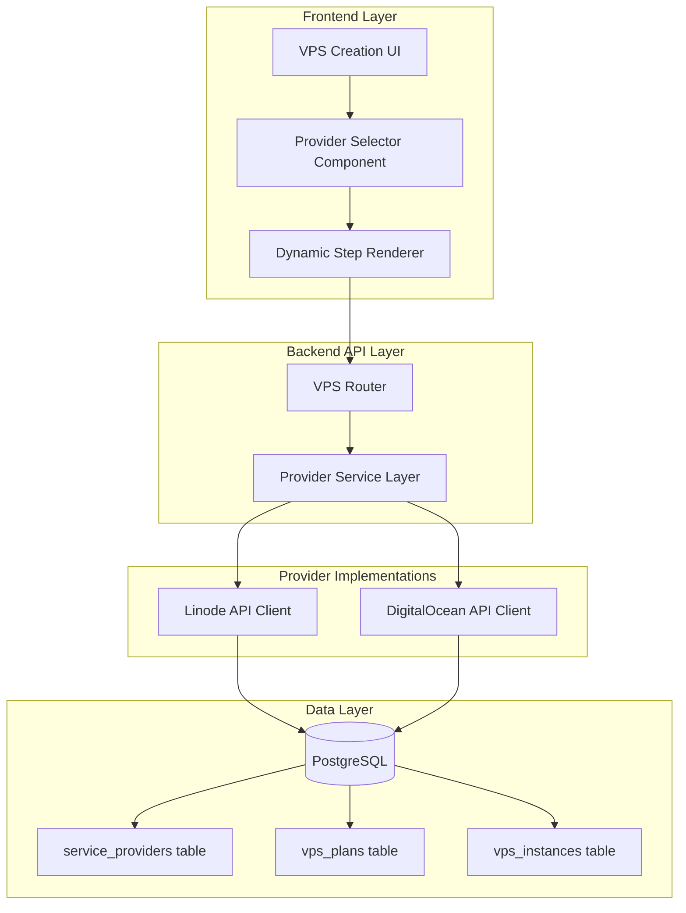
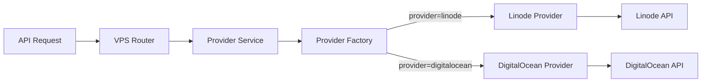

# Design Document

## Overview

This design extends the existing VPS management system to support multiple cloud providers (Linode and DigitalOcean) through a unified interface. The architecture maintains backward compatibility with the current Linode-only implementation while introducing provider abstraction layers that enable seamless integration of additional providers.

The design follows a provider-agnostic approach where the frontend adapts its UI based on the selected provider, and the backend routes API calls through a provider service layer that handles provider-specific implementations. This ensures that adding future providers requires minimal changes to the core system.

## Architecture

### High-Level Architecture



### Provider Service Layer Architecture

The provider service layer acts as an abstraction that routes operations to the appropriate provider implementation:



## Components and Interfaces

### Frontend Components

#### 1. Provider Selector Component

**Location:** `src/components/VPS/ProviderSelector.tsx`

**Purpose:** Allows users to select from active cloud providers configured by administrators.

**Props:**
```typescript
interface ProviderSelectorProps {
  value: string | null;
  onChange: (providerId: string, providerType: string) => void;
  disabled?: boolean;
}
```

**Behavior:**
- Fetches active providers from `/api/admin/providers`
- Displays provider name and optional logo/icon
- Filters to show only providers with `active = true`
- Emits both provider ID (UUID) and provider type (string) on selection

#### 2. Dynamic Step Renderer Component

**Location:** `src/components/VPS/CreateVPSSteps.tsx`

**Purpose:** Conditionally renders creation steps based on selected provider.

**Props:**
```typescript
interface CreateVPSStepsProps {
  step: number;
  providerType: 'linode' | 'digitalocean';
  formData: CreateVPSForm;
  onFormChange: (updates: Partial<CreateVPSForm>) => void;
}
```

**Step Mapping:**
- Step 1: Plan selection (provider-filtered)
- Step 2: Deployment options (StackScripts for Linode, Marketplace for DigitalOcean)
- Step 3: OS selection (provider-specific images)
- Step 4: Configuration (provider-specific options)

#### 3. DigitalOcean Marketplace Component

**Location:** `src/components/VPS/DigitalOceanMarketplace.tsx`

**Purpose:** Displays DigitalOcean 1-Click applications for step 2.

**Props:**
```typescript
interface DigitalOceanMarketplaceProps {
  selectedApp: string | null;
  onSelect: (appSlug: string, appData: Record<string, any>) => void;
}
```


**Behavior:**
- Fetches marketplace apps from `/api/vps/digitalocean/marketplace`
- Groups apps by category
- Displays app descriptions and requirements
- Handles app-specific configuration fields

#### 4. DigitalOcean OS Selection Component

**Location:** `src/components/VPS/DigitalOceanOSSelection.tsx`

**Purpose:** Displays DigitalOcean operating system images for step 3.

**Props:**
```typescript
interface DigitalOceanOSSelectionProps {
  selectedImage: string | null;
  onSelect: (imageSlug: string) => void;
  compatibleWith?: string[]; // For marketplace app compatibility
}
```

**Behavior:**
- Fetches OS images from `/api/vps/digitalocean/images`
- Groups by distribution (Ubuntu, Debian, CentOS, etc.)
- Filters by compatibility if marketplace app is selected
- Displays version information and descriptions

#### 5. DigitalOcean Configuration Component

**Location:** `src/components/VPS/DigitalOceanConfiguration.tsx`

**Purpose:** Renders DigitalOcean-specific configuration options for step 4.

**Props:**
```typescript
interface DigitalOceanConfigurationProps {
  formData: Partial<CreateVPSForm>;
  onChange: (updates: Partial<CreateVPSForm>) => void;
}
```

**Fields:**
- Root password (required)
- SSH keys (optional, multi-select)
- Backups (boolean toggle)
- Monitoring (boolean toggle, DigitalOcean-specific)
- IPv6 (boolean toggle, DigitalOcean-specific)
- VPC UUID (optional, for private networking)

### Backend Components

#### 1. Provider Service Layer

**Location:** `api/services/providerService.ts`

**Purpose:** Abstract interface for provider operations.

**Interface:**
```typescript
interface IProviderService {
  createInstance(params: CreateInstanceParams): Promise<ProviderInstance>;
  getInstance(providerId: string, instanceId: string): Promise<ProviderInstance>;
  listInstances(providerId: string): Promise<ProviderInstance[]>;
  performAction(providerId: string, instanceId: string, action: string): Promise<void>;
  getPlans(providerId: string): Promise<ProviderPlan[]>;
  getImages(providerId: string): Promise<ProviderImage[]>;
  getRegions(providerId: string): Promise<ProviderRegion[]>;
}
```

**Implementation:**
- Factory pattern to instantiate provider-specific clients
- Normalizes provider responses to common format
- Handles provider-specific error codes
- Manages API credentials from `service_providers` table


#### 2. DigitalOcean Provider Implementation

**Location:** `api/services/providers/digitaloceanProvider.ts`

**Purpose:** Implements IProviderService for DigitalOcean API.

**Key Methods:**
- `createDroplet()`: Creates a new DigitalOcean Droplet
- `getDroplet()`: Fetches Droplet details
- `listDroplets()`: Lists all Droplets for the account
- `performDropletAction()`: Executes actions (power on/off, reboot, etc.)
- `getMarketplaceApps()`: Fetches 1-Click applications
- `getImages()`: Fetches available OS images
- `getSizes()`: Fetches available Droplet sizes (plans)
- `getRegions()`: Fetches available regions

**API Integration:**
- Base URL: `https://api.digitalocean.com/v2`
- Authentication: Bearer token from `service_providers.api_key_encrypted`
- Rate limiting: 5,000 requests/hour, 250 requests/minute
- Error handling: Maps DigitalOcean error codes to standardized responses

#### 3. VPS Router Enhancements

**Location:** `api/routes/vps.ts`

**Changes:**
- Add `provider_id` parameter to POST `/api/vps` endpoint
- Route creation requests through provider service layer
- Store `provider_type` in `vps_instances` table
- Update GET `/api/vps/:id` to fetch from appropriate provider
- Add new endpoints:
  - GET `/api/vps/digitalocean/marketplace` - List marketplace apps
  - GET `/api/vps/digitalocean/images` - List OS images
  - GET `/api/vps/digitalocean/sizes` - List Droplet sizes

**Request Flow:**
```
POST /api/vps
  ↓
Extract provider_id from request body
  ↓
Fetch provider details from service_providers table
  ↓
Instantiate provider client via factory
  ↓
Call provider.createInstance()
  ↓
Store result in vps_instances with provider_type
  ↓
Return normalized response
```

#### 4. Admin Provider Management

**Location:** `api/routes/admin.ts`

**Existing Endpoints (to be used):**
- GET `/api/admin/providers` - List all providers
- POST `/api/admin/providers` - Create new provider
- PUT `/api/admin/providers/:id` - Update provider
- DELETE `/api/admin/providers/:id` - Delete provider

**Enhancements:**
- Add validation for DigitalOcean API tokens
- Test API connectivity before activating provider
- Return provider capabilities (supported features)


## Data Models

### Database Schema Changes

#### vps_instances Table (Existing, Enhanced)

```sql
-- Column already exists from migration 014
ALTER TABLE vps_instances 
  ADD COLUMN IF NOT EXISTS provider_type VARCHAR(50);

CREATE INDEX IF NOT EXISTS idx_vps_instances_provider_type 
  ON vps_instances(provider_type);

-- Add provider_id foreign key for direct reference
ALTER TABLE vps_instances 
  ADD COLUMN IF NOT EXISTS provider_id UUID 
  REFERENCES service_providers(id) ON DELETE SET NULL;

CREATE INDEX IF NOT EXISTS idx_vps_instances_provider_id 
  ON vps_instances(provider_id);
```

**Purpose:** Links VPS instances to their provider for routing API calls.

#### vps_plans Table (Existing, No Changes)

Already has `provider_id` foreign key from migration 005.

```sql
-- Existing structure (no changes needed)
CREATE TABLE vps_plans (
  id UUID PRIMARY KEY DEFAULT uuid_generate_v4(),
  provider_id UUID REFERENCES service_providers(id) ON DELETE CASCADE,
  provider_plan_id VARCHAR(255) NOT NULL,
  base_price DECIMAL(10,2) NOT NULL DEFAULT 0.00,
  markup_price DECIMAL(10,2) NOT NULL DEFAULT 0.00,
  specifications JSONB NOT NULL DEFAULT '{}',
  active BOOLEAN NOT NULL DEFAULT true,
  created_at TIMESTAMPTZ NOT NULL DEFAULT NOW(),
  updated_at TIMESTAMPTZ NOT NULL DEFAULT NOW()
);
```

#### service_providers Table (Existing, No Changes)

Already supports multiple providers from migration 014.

```sql
-- Existing structure (no changes needed)
CREATE TABLE service_providers (
  id UUID PRIMARY KEY DEFAULT uuid_generate_v4(),
  name VARCHAR(255) NOT NULL,
  type VARCHAR(50) NOT NULL CHECK (type IN ('linode', 'digitalocean', 'aws', 'gcp')),
  api_key_encrypted TEXT NOT NULL,
  configuration JSONB NOT NULL DEFAULT '{}',
  active BOOLEAN NOT NULL DEFAULT true,
  created_at TIMESTAMPTZ NOT NULL DEFAULT NOW(),
  updated_at TIMESTAMPTZ NOT NULL DEFAULT NOW()
);
```

### TypeScript Interfaces

#### Provider Types

```typescript
// src/types/provider.ts
export type ProviderType = 'linode' | 'digitalocean' | 'aws' | 'gcp';

export interface Provider {
  id: string;
  name: string;
  type: ProviderType;
  active: boolean;
  configuration: Record<string, any>;
  created_at: string;
  updated_at: string;
}

export interface ProviderPlan {
  id: string;
  label: string;
  vcpus: number;
  memory: number; // MB
  disk: number; // GB
  transfer: number; // GB
  price: {
    hourly: number;
    monthly: number;
  };
  regions: string[];
}

export interface ProviderImage {
  id: string;
  slug: string;
  name: string;
  distribution: string;
  version?: string;
  description?: string;
  minDiskSize?: number;
}

export interface ProviderRegion {
  id: string;
  name: string;
  slug: string;
  available: boolean;
  features: string[];
}
```


#### VPS Instance Types

```typescript
// src/types/vps.ts (Enhanced)
export interface VPSInstance {
  id: string;
  label: string;
  status: 'running' | 'stopped' | 'provisioning' | 'error';
  ip_address: string | null;
  region: string;
  plan_id: string | null;
  provider_id: string | null; // NEW
  provider_type: ProviderType | null; // NEW
  provider_instance_id: string;
  configuration: Record<string, any>;
  created_at: string;
  updated_at: string;
  // Plan details (joined)
  plan_specs?: {
    vcpus: number;
    memory: number;
    disk: number;
    transfer: number;
  };
  hourly_rate?: number;
  monthly_rate?: number;
}

export interface CreateVPSForm {
  provider_id: string; // NEW - Required
  provider_type: ProviderType; // NEW - Required
  label: string;
  type: string; // Plan ID or provider plan ID
  region: string;
  image: string;
  rootPassword: string;
  sshKeys: string[];
  backups: boolean;
  privateIP: boolean;
  // DigitalOcean-specific
  monitoring?: boolean;
  ipv6?: boolean;
  vpc_uuid?: string;
  // Marketplace/StackScript
  appSlug?: string;
  appData?: Record<string, any>;
  stackscriptId?: number;
  stackscriptData?: Record<string, any>;
}
```

## Error Handling

### Provider-Specific Error Mapping

Each provider returns different error formats. The provider service layer normalizes these:

**Linode Error Format:**
```json
{
  "errors": [
    {
      "field": "region",
      "reason": "Region is not available"
    }
  ]
}
```

**DigitalOcean Error Format:**
```json
{
  "id": "not_found",
  "message": "The resource you requested could not be found."
}
```

**Normalized Error Format:**
```typescript
interface ProviderError {
  code: string;
  message: string;
  field?: string;
  provider: ProviderType;
}
```

### Error Handling Strategy

1. **API Credential Errors:** Return 503 Service Unavailable with message to contact administrator
2. **Validation Errors:** Return 400 Bad Request with specific field errors
3. **Rate Limit Errors:** Return 429 Too Many Requests with retry-after header
4. **Provider Outage:** Return 503 Service Unavailable with provider status
5. **Insufficient Resources:** Return 400 Bad Request with resource limits


## Testing Strategy

### Unit Tests

**Provider Service Layer:**
- Test provider factory instantiation
- Test error normalization
- Test response transformation
- Mock provider API clients

**DigitalOcean Provider:**
- Test Droplet creation with various configurations
- Test marketplace app integration
- Test image filtering and compatibility
- Test action execution (power on/off, reboot)
- Mock DigitalOcean API responses

**Frontend Components:**
- Test provider selector rendering
- Test step rendering based on provider
- Test form validation per provider
- Test error display

### Integration Tests

**VPS Creation Flow:**
- Test end-to-end Linode VPS creation (existing)
- Test end-to-end DigitalOcean VPS creation (new)
- Test provider switching during creation
- Test plan filtering by provider
- Test marketplace app deployment

**VPS Management:**
- Test instance listing with mixed providers
- Test provider filtering
- Test instance details for each provider
- Test actions on each provider type

**Admin Configuration:**
- Test provider activation/deactivation
- Test API credential validation
- Test plan creation per provider
- Test provider status display

### Manual Testing Checklist

- [ ] Create VPS with Linode (verify existing functionality)
- [ ] Create VPS with DigitalOcean
- [ ] Deploy marketplace app on DigitalOcean
- [ ] View mixed provider instances in table
- [ ] Filter instances by provider
- [ ] View DigitalOcean instance details
- [ ] Perform actions on DigitalOcean instance
- [ ] Configure DigitalOcean provider in admin
- [ ] Create DigitalOcean plans in admin
- [ ] Disable provider and verify UI updates
- [ ] Test error scenarios (invalid credentials, rate limits)

## Implementation Phases

### Phase 1: Backend Foundation
- Create provider service layer interface
- Implement DigitalOcean provider client
- Add provider routing to VPS endpoints
- Update database schema (provider_id in vps_instances)
- Add DigitalOcean-specific endpoints

### Phase 2: Frontend Provider Selection
- Create provider selector component
- Update VPS creation modal to include provider selector
- Filter plans by selected provider
- Update form state to include provider information

### Phase 3: DigitalOcean-Specific UI
- Create DigitalOcean marketplace component
- Create DigitalOcean OS selection component
- Create DigitalOcean configuration component
- Implement dynamic step rendering

### Phase 4: VPS Management Updates
- Add provider column to VPS table
- Add provider filtering
- Update VPS detail page for DigitalOcean
- Update action handlers for DigitalOcean

### Phase 5: Admin Configuration
- Enhance provider management UI
- Add API credential validation
- Add provider status indicators
- Update plan management for multiple providers

### Phase 6: Testing and Polish
- Write unit tests
- Write integration tests
- Perform manual testing
- Fix bugs and edge cases
- Update documentation


## API Endpoints

### New Endpoints

#### GET `/api/vps/digitalocean/marketplace`
**Purpose:** Fetch DigitalOcean 1-Click marketplace applications

**Authentication:** Required

**Response:**
```json
{
  "apps": [
    {
      "slug": "wordpress",
      "name": "WordPress",
      "description": "WordPress is a popular content management system",
      "category": "CMS",
      "image_slug": "wordpress-20-04",
      "compatible_images": ["ubuntu-20-04-x64", "ubuntu-22-04-x64"]
    }
  ]
}
```

#### GET `/api/vps/digitalocean/images`
**Purpose:** Fetch DigitalOcean OS images

**Authentication:** Required

**Query Parameters:**
- `type` (optional): Filter by type (distribution, application, custom)

**Response:**
```json
{
  "images": [
    {
      "id": 123456,
      "slug": "ubuntu-22-04-x64",
      "name": "Ubuntu 22.04 x64",
      "distribution": "Ubuntu",
      "version": "22.04",
      "min_disk_size": 15,
      "public": true
    }
  ]
}
```

#### GET `/api/vps/digitalocean/sizes`
**Purpose:** Fetch DigitalOcean Droplet sizes (plans)

**Authentication:** Required

**Response:**
```json
{
  "sizes": [
    {
      "slug": "s-1vcpu-1gb",
      "memory": 1024,
      "vcpus": 1,
      "disk": 25,
      "transfer": 1.0,
      "price_monthly": 6.00,
      "price_hourly": 0.00893,
      "regions": ["nyc1", "nyc3", "sfo3"],
      "available": true
    }
  ]
}
```

### Modified Endpoints

#### POST `/api/vps`
**Changes:** Add `provider_id` and `provider_type` to request body

**Request Body (Enhanced):**
```json
{
  "provider_id": "uuid-of-provider",
  "provider_type": "digitalocean",
  "label": "my-server",
  "type": "s-1vcpu-1gb",
  "region": "nyc3",
  "image": "ubuntu-22-04-x64",
  "rootPassword": "secure-password",
  "sshKeys": [],
  "backups": false,
  "monitoring": true,
  "ipv6": true,
  "vpc_uuid": null,
  "appSlug": "wordpress"
}
```

#### GET `/api/vps/:id`
**Changes:** Fetch from appropriate provider based on `provider_type`

**Response (Enhanced):**
```json
{
  "instance": {
    "id": "internal-uuid",
    "provider_id": "provider-uuid",
    "provider_type": "digitalocean",
    "provider_instance_id": "droplet-id",
    "label": "my-server",
    "status": "running",
    "ip_address": "192.0.2.1",
    "region": "nyc3",
    "plan_specs": {
      "vcpus": 1,
      "memory": 1024,
      "disk": 25,
      "transfer": 1000
    },
    "hourly_rate": 0.00893,
    "monthly_rate": 6.00,
    "created_at": "2024-01-01T00:00:00Z"
  }
}
```

## Security Considerations

### API Key Storage
- Store provider API keys encrypted in `service_providers.api_key_encrypted`
- Use existing encryption utilities from `api/lib/crypto.ts`
- Never expose API keys in frontend responses

### Provider Isolation
- Ensure users can only access VPS instances in their organization
- Validate provider_id matches organization's configured providers
- Prevent cross-provider API calls

### Rate Limiting
- Apply existing rate limiting middleware to new endpoints
- Implement provider-specific rate limit tracking
- Return appropriate retry-after headers

### Input Validation
- Validate all provider-specific parameters
- Sanitize user inputs before passing to provider APIs
- Validate region/plan/image compatibility

## Migration Strategy

### Backward Compatibility
- Existing Linode VPS instances continue to work without changes
- Default to Linode provider if `provider_type` is null
- Populate `provider_type` for existing instances via migration script

### Data Migration
```sql
-- Populate provider_type for existing Linode instances
UPDATE vps_instances 
SET provider_type = 'linode',
    provider_id = (SELECT id FROM service_providers WHERE type = 'linode' LIMIT 1)
WHERE provider_type IS NULL;
```

### Rollback Plan
- Feature flag to disable DigitalOcean provider
- Revert database changes via down migration
- Remove new API endpoints
- Restore original VPS creation UI

## Performance Considerations

### Caching Strategy
- Cache provider plans for 1 hour
- Cache OS images for 1 hour
- Cache marketplace apps for 6 hours
- Invalidate cache on provider configuration change

### Lazy Loading
- Load provider-specific components only when selected
- Preload common providers (Linode, DigitalOcean)
- Defer loading of marketplace apps until step 2

### Database Optimization
- Index on `vps_instances.provider_type` for filtering
- Index on `vps_instances.provider_id` for joins
- Index on `vps_plans.provider_id` for plan filtering

## Monitoring and Logging

### Metrics to Track
- VPS creation success rate per provider
- API response times per provider
- Provider API error rates
- Provider selection distribution

### Logging Strategy
- Log all provider API calls with request/response
- Log provider selection in VPS creation flow
- Log provider-specific errors with context
- Include provider type in activity logs
