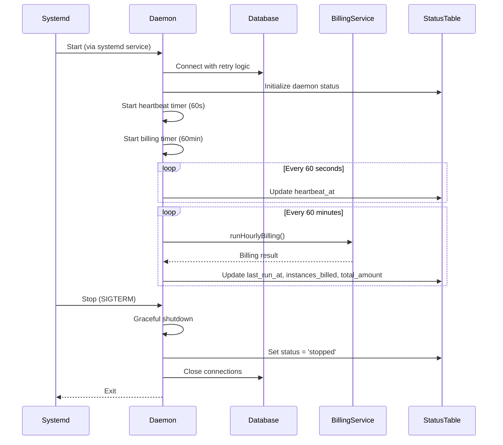
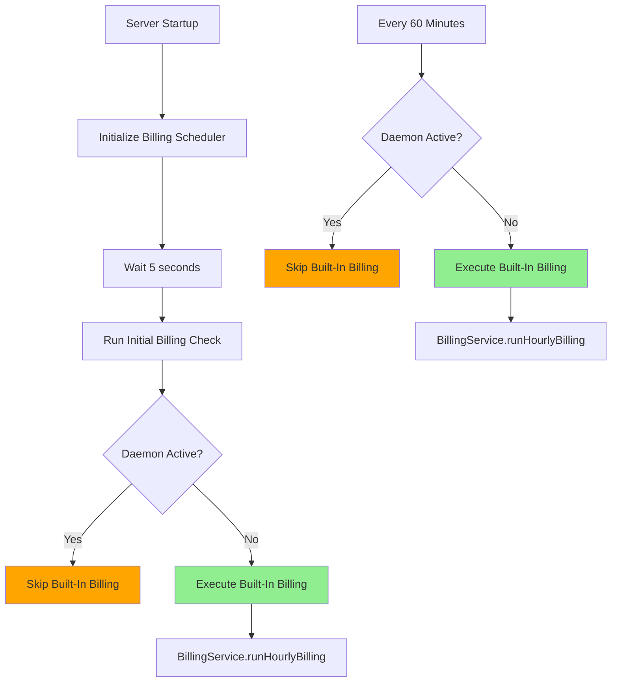
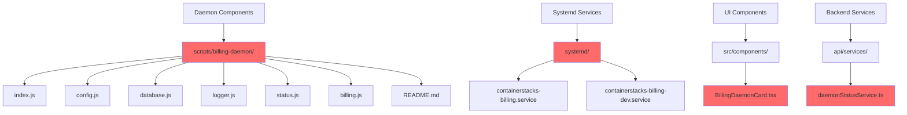
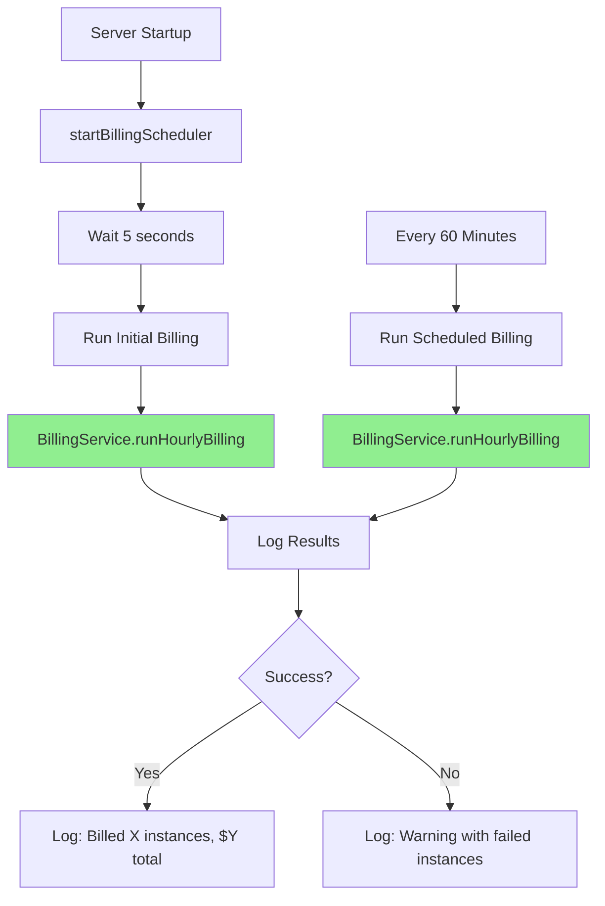
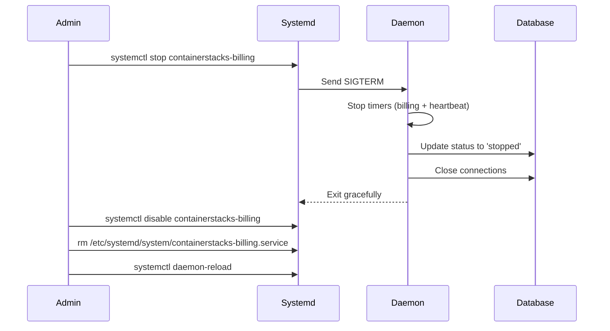

# Billing Daemon Removal Design

## 1. Overview

### 1.1 Purpose

This design outlines the complete removal of the standalone billing daemon from ContainerStacks and consolidation of all billing operations into the built-in hourly billing cron system within the main application.

### 1.2 Background

ContainerStacks currently operates two parallel billing systems:

- **Standalone Billing Daemon**: An independent process (`scripts/billing-daemon/`) that runs as a separate systemd service, executing hourly VPS billing cycles with heartbeat monitoring and status tracking
- **Built-In Hourly Billing**: An integrated cron scheduler (`api/server.ts`) that runs hourly billing within the main application process, activating only when the daemon is inactive (heartbeat exceeds 90 minutes)

The daemon was originally implemented to ensure continuous billing during application downtime. However, maintaining two parallel billing systems introduces unnecessary complexity, operational overhead, and potential synchronization issues.

### 1.3 Goals

- **Simplify Architecture**: Eliminate dual billing system complexity by consolidating to a single, integrated solution
- **Reduce Operational Overhead**: Remove systemd service management, daemon monitoring, and coordination logic
- **Maintain Billing Reliability**: Ensure hourly VPS billing continues without interruption
- **Preserve Billing History**: Retain all historical billing daemon status records for audit purposes
- **Clean Codebase**: Remove all daemon-related code, configuration, and documentation

### 1.4 Non-Goals

- Changing billing logic or calculation algorithms
- Modifying billing interval frequency (remains hourly)
- Altering database schema for VPS billing cycles or payment transactions
- Implementing new billing features or capabilities

## 2. Current Architecture

### 2.1 Standalone Billing Daemon

#### Component Structure

The daemon consists of six modular components:

| Module | Purpose | Key Responsibilities |
|--------|---------|---------------------|
| `index.js` | Main entry point | Process orchestration, signal handling, graceful shutdown |
| `config.js` | Configuration | Environment variable loading, OS detection, validation |
| `database.js` | Database connectivity | PostgreSQL connection pooling, retry logic |
| `logger.js` | Logging | Structured logging with systemd integration |
| `status.js` | Status management | Heartbeat updates (60s interval), instance ID generation |
| `billing.js` | Billing execution | Wraps `BillingService.runHourlyBilling()` with error handling |

#### Operational Flow

#### Deployment Configuration

| Artifact | Purpose | Location |
|----------|---------|----------|
| Production Service | Systemd service (secure, dedicated user) | `systemd/containerstacks-billing.service` |
| Development Service | Systemd service (root user, simplified) | `systemd/containerstacks-billing-dev.service` |
| PM2 Config | PM2 process manager configuration | `ecosystem.config.cjs` (not used for daemon) |

### 2.2 Built-In Hourly Billing

#### Activation Logic

The built-in billing operates as a fallback mechanism with daemon coordination:

#### Coordination Mechanism

Daemon activity determination relies on heartbeat freshness:

| Condition | Daemon Status | Built-In Billing Action |
|-----------|---------------|------------------------|
| `heartbeat_at` within 90 minutes | Active | Pause (daemon handles billing) |
| `heartbeat_at` exceeds 90 minutes | Inactive | Resume (built-in takes over) |
| No `heartbeat_at` record | Unknown | Resume (assume daemon not running) |

### 2.3 Database Schema

#### billing_daemon_status Table

Tracks daemon health and billing execution history:

| Column | Type | Purpose |
|--------|------|---------|
| `id` | SERIAL | Primary key |
| `daemon_instance_id` | VARCHAR(255) | Unique identifier (hostname-PID) |
| `status` | VARCHAR(50) | Current state: 'running', 'stopped', 'error' |
| `last_run_at` | TIMESTAMPTZ | Last billing execution timestamp |
| `last_run_success` | BOOLEAN | Success flag for last billing run |
| `instances_billed` | INTEGER | Count of VPS instances billed in last run |
| `total_amount` | DECIMAL(10,2) | Total amount charged in last run |
| `total_hours` | DECIMAL(10,2) | Total billable hours processed |
| `error_message` | TEXT | Error details if billing failed |
| `started_at` | TIMESTAMPTZ | Daemon process start time |
| `heartbeat_at` | TIMESTAMPTZ | Last heartbeat update (60s interval) |
| `metadata` | JSONB | Additional daemon info (OS, version, etc.) |
| `created_at` | TIMESTAMPTZ | Record creation timestamp |
| `updated_at` | TIMESTAMPTZ | Last update timestamp |

**Indexes:**
- `idx_billing_daemon_status_heartbeat` on `heartbeat_at`
- `idx_billing_daemon_status_instance` on `daemon_instance_id`

### 2.4 User Interface Components

#### BillingDaemonCard (Status Dashboard)

Frontend component displaying daemon health on the admin Status page:

| Metric | Display | Data Source |
|--------|---------|-------------|
| Status Badge | Running/Stopped/Warning/Error | `daemon.status` + `warningThresholdExceeded` |
| Last Run | Relative time (e.g., "5 minutes ago") | `daemon.lastRun` |
| Instances Billed | Count badge | `daemon.instancesBilled` |
| Total Amount | Currency display | `daemon.totalAmount` |
| Warning Alert | Yellow banner if no run in 90+ minutes | `daemon.warningThresholdExceeded` |

**API Endpoint:** `GET /api/health/billing-daemon` (admin-only)

## 3. Removal Strategy

### 3.1 Component Removal Scope

#### Files to Delete

#### Database Migration Strategy

**Approach**: Preserve historical data, remove only the table structure definition from future installations

| Action | Rationale |
|--------|-----------|
| Keep existing `billing_daemon_status` table | Preserve audit trail and historical billing execution records |
| Create rollback migration | Allow table recreation if daemon needs to be restored |
| Document deprecation | Mark table as deprecated in migration comments |

**Note**: The table will remain in existing databases but will not be created in new installations once migration 012 is updated.

### 3.2 Code Modification Scope

#### Backend Changes

| File | Modification Type | Description |
|------|-------------------|-------------|
| `api/server.ts` | Simplify | Remove daemon coordination logic from `runCoordinatedBilling()` |
| `api/routes/health.ts` | Remove endpoint | Delete `GET /api/health/billing-daemon` route |
| `migrations/012_billing_daemon_status.sql` | Deprecate | Update comments to mark as deprecated/legacy |

#### Frontend Changes

| File | Modification Type | Description |
|------|-------------------|-------------|
| `src/pages/Status.tsx` | Remove import/usage | Delete `BillingDaemonCard` component instantiation |
| `src/components/BillingDaemonCard.tsx` | Delete file | Remove entire component |

#### Documentation Changes

| File | Modification Type | Description |
|------|-------------------|-------------|
| `docs/architecture/system-architecture.md` | Update | Remove daemon references, update billing section |
| `scripts/README-TEST-BILLING.md` | Retain | Keep testing documentation (still relevant for built-in billing) |
| `README.md` | Update | Remove daemon setup/deployment instructions |

### 3.3 Refactored Built-In Billing

#### Updated Billing Scheduler Architecture

#### Simplified Billing Function

The refactored `startBillingScheduler()` will:

1. **Remove Daemon Coordination**
   - Eliminate `DaemonStatusService.isDaemonActive()` check
   - Remove conditional logic that skips billing when daemon is active
   - Delete "daemon takes priority" log messages

2. **Direct Execution**
   - Call `BillingService.runHourlyBilling()` directly on schedule
   - Maintain 5-second startup delay for initial billing
   - Continue hourly interval (3,600,000 ms)

3. **Preserve Error Handling**
   - Keep existing error logging and failed instance warnings
   - Maintain billing result logging (instances billed, total amount)

**Function Signature (Unchanged):**
- `startBillingScheduler(): void`

**Behavior Changes:**

| Before (With Daemon Coordination) | After (Simplified) |
|-----------------------------------|-------------------|
| Check if daemon is active | *(Check removed)* |
| If daemon active → skip billing | *(Logic removed)* |
| If daemon inactive → run billing | Always run billing |
| Log coordination status | Log billing execution only |

## 4. Transition Plan

### 4.1 Pre-Removal Validation

Before proceeding with removal, validate the following:

| Validation Check | Purpose | Method |
|------------------|---------|--------|
| Built-in billing is functional | Ensure fallback system works | Run test suite: `npm run test:billing` |
| No active daemon instances | Prevent duplicate billing during transition | Query: `SELECT * FROM billing_daemon_status WHERE heartbeat_at > NOW() - INTERVAL '2 minutes'` |
| Recent billing cycles exist | Confirm billing is occurring | Query: `SELECT COUNT(*) FROM vps_billing_cycles WHERE created_at > NOW() - INTERVAL '2 hours'` |

### 4.2 Daemon Shutdown Procedure

For systems with the daemon currently running:

**Commands:**
1. `sudo systemctl stop containerstacks-billing`
2. `sudo systemctl disable containerstacks-billing`
3. `sudo rm /etc/systemd/system/containerstacks-billing.service`
4. `sudo systemctl daemon-reload`

### 4.3 Verification After Transition

Post-removal validation steps:

| Check | Expected Result | Validation Method |
|-------|----------------|-------------------|
| Built-in billing executes | Log shows "Starting hourly VPS billing process..." | Monitor application logs |
| VPS instances are billed | New records in `vps_billing_cycles` table | Query billing cycles table |
| No daemon processes | No billing-daemon processes running | `ps aux \| grep billing-daemon` |
| No systemd errors | No failed service entries | `systemctl list-units --failed` |

### 4.4 Rollback Strategy

If issues arise, the daemon can be restored:

| Step | Action |
|------|--------|
| 1. Stop Application | Prevent dual billing during restoration |
| 2. Restore Files | Re-add deleted daemon files from version control |
| 3. Restore Services | Copy systemd service files back to `/etc/systemd/system/` |
| 4. Reload Systemd | `systemctl daemon-reload` |
| 5. Start Daemon | `systemctl start containerstacks-billing` |
| 6. Verify Operation | Check daemon heartbeat in `billing_daemon_status` table |
| 7. Restart Application | Resume normal operations |

**Grace Period**: Recommend 48 hours of monitoring before permanent removal from version control.

## 5. Impact Analysis

### 5.1 Operational Changes

| Area | Before | After | Impact Level |
|------|--------|-------|--------------|
| Billing Execution | Daemon-first, built-in fallback | Built-in only | Low (same BillingService) |
| Process Management | 2 processes (app + daemon) | 1 process (app only) | Medium (simplified) |
| Systemd Services | 2 services | 1 service | Medium (reduced complexity) |
| Monitoring | Daemon heartbeat + app health | App health only | Low (standard monitoring) |
| Deployment | App + daemon services | App service only | Medium (simplified) |

### 5.2 User Experience

| User Type | Impact | Details |
|-----------|--------|---------|
| End Users (VPS Customers) | None | Billing continues transparently |
| Admins | Minor | Status page loses daemon health card |
| DevOps/Operators | Positive | Fewer services to manage and monitor |

### 5.3 System Behavior

#### Billing Reliability

| Scenario | Before | After | Assessment |
|----------|--------|-------|------------|
| Normal operation | Daemon bills hourly | Built-in bills hourly | Identical |
| App restart | Daemon continues billing | Billing pauses briefly during restart | Acceptable (5s delay on startup) |
| Database outage | Both fail | Built-in fails | Identical |
| High load | Daemon isolated | Built-in shares app resources | Minimal risk (billing is lightweight) |

**Risk Mitigation**:
- Built-in billing runs in the same process that handles API requests and already executes critical business logic
- Hourly billing operations are lightweight (database queries + wallet deductions)
- Existing error handling and transaction rollbacks prevent data corruption

#### Downtime Scenarios

| Failure Mode | Daemon System | Built-In Only System | Difference |
|--------------|---------------|---------------------|-----------|
| App crash | Daemon continues | Billing pauses | Billing resumes on app restart (5s) |
| App deployment | Daemon continues | Billing pauses | Brief pause during deployment (<1 min typical) |
| Server reboot | Both restart | Both restart | Identical |

**Assessment**: The built-in system introduces brief billing pauses during application restarts, but these are acceptable given:
- Modern container orchestration (PM2, systemd) ensures rapid restarts (<5s)
- Billing logic calculates hours based on `last_billed_at` timestamp, preventing missed charges
- Deployment windows are typically during low-traffic periods

### 5.4 Benefits

| Benefit | Description | Quantifiable Impact |
|---------|-------------|---------------------|
| Simplified Architecture | Single billing execution path | 1 cron scheduler vs. 2 systems |
| Reduced Code Complexity | Remove 6 daemon modules + coordination logic | ~800 lines of code removed |
| Lower Operational Overhead | Fewer systemd services to manage | 1 service instead of 2 |
| Easier Debugging | Single execution context for billing issues | Consolidated logs, no inter-process coordination |
| Reduced Attack Surface | Fewer running processes | 1 process instead of 2 |

## 6. Testing Strategy

### 6.1 Unit Testing

No new unit tests are required. Existing tests for `BillingService` remain valid and unchanged.

**Validation Focus:**
- `BillingService.runHourlyBilling()` continues to function correctly
- Billing calculations remain accurate
- Transaction handling and rollbacks work as expected

### 6.2 Integration Testing

Utilize existing test script: `scripts/test-hourly-billing.js`

**Test Scenarios:**

| Scenario | Validation |
|----------|------------|
| Initial billing on VPS creation | First hour charged correctly |
| Hourly billing cycles | Each hour charges flat rate (no accumulation) |
| Insufficient wallet balance | Billing cycle marked as 'failed' |
| Wallet deduction | Balance decreases by hourly rate |
| Billing history | Records created in `vps_billing_cycles` table |

**Expected Output:**
- ✅ Each hour charges the same flat rate
- ✅ No accumulation detected
- ✅ All VPS instances billed regardless of status

### 6.3 System Testing

Manual validation in staging/production:

| Test | Procedure | Success Criteria |
|------|-----------|------------------|
| Application Startup | Restart application, monitor logs | "Starting hourly VPS billing scheduler" appears in logs |
| Initial Billing Run | Wait 5 seconds after startup | "Starting hourly VPS billing process..." appears |
| Hourly Execution | Wait 1 hour | Billing executes automatically on schedule |
| VPS Billing | Create test VPS, wait 1 hour | New billing cycle record created |
| Error Handling | Simulate database error | Errors logged, application continues running |

### 6.4 Regression Testing

Verify no impact on related features:

| Feature | Test |
|---------|------|
| VPS Creation | Create new VPS → initial hour charged |
| VPS Deletion | Delete VPS → billing stops |
| Wallet Top-Up | Add funds → balance increases |
| Invoice Generation | Monthly invoices include VPS charges |
| Payment Transactions | Billing creates wallet debit transactions |

## 7. Documentation Updates

### 7.1 Architecture Documentation

**File:** `docs/architecture/system-architecture.md`

**Changes:**

| Section | Modification |
|---------|--------------|
| Hourly Billing Cycle | Remove "Cron Job via Bull queue" reference, update to "Built-in cron scheduler (setInterval)" |
| System Components | Remove billing daemon component |
| Process Diagram | Update to show single billing execution path |

### 7.2 Deployment Documentation

**File:** `README.md`

**Changes:**

| Section | Action |
|---------|--------|
| Service Management | Remove billing daemon systemd service instructions |
| Running in Production | Remove PM2 billing daemon configuration (if present) |
| Environment Variables | Remove daemon-specific variables (`BILLING_INTERVAL_MINUTES` if only used by daemon) |
| Troubleshooting | Remove daemon-specific troubleshooting steps |

### 7.3 Developer Documentation

**File:** `scripts/README-TEST-BILLING.md`

**Changes:**

| Section | Action |
|---------|--------|
| Overview | Update to reflect built-in billing only |
| Related Files | Remove daemon file references, keep `api/server.ts` reference |

### 7.4 Migration Documentation

**File:** `migrations/012_billing_daemon_status.sql`

**Changes:**

Add deprecation notice as comment header:

> **DEPRECATED**: This table was used by the standalone billing daemon which has been removed.
> The table remains for historical audit purposes but is no longer actively used.
> Built-in billing scheduler in `api/server.ts` now handles all hourly billing operations.

## 8. Implementation Checklist

### 8.1 Code Changes

- [ ] Delete `scripts/billing-daemon/` directory and all contents
- [ ] Delete `systemd/containerstacks-billing.service`
- [ ] Delete `systemd/containerstacks-billing-dev.service`
- [ ] Delete `src/components/BillingDaemonCard.tsx`
- [ ] Delete `api/services/daemonStatusService.ts`
- [ ] Update `api/server.ts`:
  - [ ] Remove `DaemonStatusService` import
  - [ ] Remove daemon coordination logic from `runCoordinatedBilling()`
  - [ ] Simplify function to always execute billing
  - [ ] Update log messages
- [ ] Update `api/routes/health.ts`:
  - [ ] Remove `DaemonStatusService` import
  - [ ] Delete `GET /api/health/billing-daemon` endpoint
- [ ] Update `src/pages/Status.tsx`:
  - [ ] Remove `BillingDaemonCard` import
  - [ ] Remove component from render

### 8.2 Database Changes

- [ ] Add deprecation comment to `migrations/012_billing_daemon_status.sql`
- [ ] Verify no application code queries `billing_daemon_status` table
- [ ] Document table preservation rationale in migration comments

### 8.3 Documentation Changes

- [ ] Update `README.md` to remove daemon references
- [ ] Update `docs/architecture/system-architecture.md` to reflect single billing path
- [ ] Update `scripts/README-TEST-BILLING.md` to remove daemon mentions
- [ ] Add changelog entry documenting daemon removal

### 8.4 Testing & Validation

- [ ] Run `npm run test:billing` to validate BillingService
- [ ] Execute `scripts/test-hourly-billing.js` in staging
- [ ] Monitor application logs for 24 hours post-deployment
- [ ] Verify hourly billing cycles are created
- [ ] Confirm no duplicate billing occurs
- [ ] Check system resource usage (should decrease slightly)

### 8.5 Deployment Steps

- [ ] Stop billing daemon on target system: `systemctl stop containerstacks-billing`
- [ ] Disable daemon service: `systemctl disable containerstacks-billing`
- [ ] Deploy updated application code
- [ ] Restart application service
- [ ] Monitor logs for initial billing execution (5s delay)
- [ ] Wait 1 hour and verify scheduled billing runs
- [ ] Remove systemd service file: `rm /etc/systemd/system/containerstacks-billing.service`
- [ ] Reload systemd: `systemctl daemon-reload`

### 8.6 Post-Deployment Verification

- [ ] Confirm no `billing-daemon` processes running: `ps aux | grep billing-daemon`
- [ ] Verify hourly billing executes: Check application logs
- [ ] Check billing cycle records: Query `vps_billing_cycles` table
- [ ] Monitor for 48 hours to ensure stability
- [ ] Remove deleted files from version control permanently
