# ContainerStacks - Product Requirements Document

## 1. Product Overview

ContainerStacks is an open-source, Node.js-based container-as-a-service (CaaS) platform that enables service providers to offer comprehensive Docker container hosting, management, and orchestration services with built-in billing, monitoring, and collaboration features.

The platform solves the complexity of container infrastructure management for service providers and development teams, offering a turnkey solution with white-label capabilities, automated scaling, and enterprise-grade features for multi-tenant environments.

Target market includes hosting providers, DevOps teams, and organizations seeking to monetize container hosting services with minimal infrastructure overhead.

## 2. Core Features

### 2.1 User Roles

| Role | Registration Method | Core Permissions |
|------|---------------------|------------------|
| Service Provider Admin | Platform installation setup | Full platform configuration, billing management, white-label customization |
| Organization Admin | Invitation or self-registration | Manage organization users, billing, resource quotas, collaboration settings |
| Developer | Email registration or invitation | Deploy containers, manage applications, access logs and metrics |
| Collaborator | Invitation only | Limited access to specific projects, images, and registries |

### 2.2 Feature Module

Our ContainerStacks platform consists of the following main pages:

1. **Dashboard**: Overview widgets, resource usage, quick actions, recent activity
2. **Container Management**: Container lifecycle, deployment, scaling, monitoring
3. **VPS Management**: VPS instances, server plans, provider integration, reseller markup
4. **Marketplace**: Pre-built applications, custom images, deployment templates
5. **Billing & Wallet**: Account wallet, invoices, payment history, PayPal integration
6. **Support Tickets**: Ticket creation, admin responses, status tracking, communication
7. **Resource Management**: CPU/memory limits, storage quotas, network policies
8. **Monitoring & Logs**: Real-time metrics, application logs, performance insights
9. **Backups**: Automated backups, restore points, encryption settings
10. **Collaboration**: Team management, permissions, shared workspaces
11. **Service Providers**: API key management, provider configuration, cost tracking
12. **Admin Panel**: User management, system settings, platform configuration

### 2.3 Page Details

| Page Name | Module Name | Feature description |
|-----------|-------------|---------------------|
| Dashboard | Overview Panel | Display active containers, VPS instances, wallet balance, and system health metrics |
| Dashboard | Quick Actions | Deploy new container, create VPS, access marketplace, view support tickets |
| Container Management | Container List | View all containers with status, resource usage, uptime, and quick action buttons |
| Container Management | Deployment Wizard | Step-by-step container deployment with image selection, resource allocation, environment variables |
| Container Management | Scaling Controls | Configure auto-scaling rules, manual scaling, resource limit adjustments |
| Container Management | Container Details | Detailed view with logs, metrics, network settings, volume mounts, restart policies |
| VPS Management | VPS Instances | Create, manage, and monitor VPS instances from integrated cloud providers (Linode/Akamai) |
| VPS Management | Server Plans | Create reseller VPS plans with markup pricing and custom configurations |
| VPS Management | Provider Integration | Manage cloud provider API keys and monitor costs across multiple providers |
| Marketplace | App Gallery | Browse categorized pre-built applications with ratings, descriptions, and installation guides |
| Marketplace | One-Click Deploy | Automated deployment of marketplace apps with pre-configured settings |
| Marketplace | Custom Images | Build, store, and manage custom Docker images with integrated registry |
| Billing & Wallet | Account Wallet | Manage client account balance, add funds via PayPal, and track spending |
| Billing & Wallet | Invoice Management | Generate, send, and track invoices for services with automated billing cycles |
| Billing & Wallet | Payment Processing | Process PayPal payments, handle refunds, and manage payment methods |
| Support Tickets | Ticket Creation | Allow clients to create support tickets with categories, priorities, and file attachments |
| Support Tickets | Admin Responses | Enable admins to reply to tickets, change status, and escalate issues |
| Support Tickets | Email Integration | Send ticket notifications and updates via SMTP2GO email service |
| Resource Management | Resource Packages | Create and assign CPU, memory, storage, and bandwidth packages to users |
| Resource Management | Usage Monitoring | Real-time and historical resource consumption with alerts and limits |
| Monitoring & Logs | Metrics Dashboard | CPU, memory, network, and disk I/O metrics with customizable time ranges |
| Monitoring & Logs | Log Viewer | Real-time and historical container logs with search, filtering, and export |
| Backups | Backup Scheduler | Configure automated backups with retention policies and encryption |
| Backups | Restore Interface | Browse and restore backups with point-in-time recovery options |
| Collaboration | Team Management | Invite users, assign roles, manage permissions for projects and resources |
| Collaboration | Project Sharing | Share containers, images, and configurations with team members |
| Service Providers | API Key Management | Store and manage cloud provider API keys with encryption and access controls |
| Service Providers | Provider Configuration | Configure Linode/Akamai settings, regions, and service availability |
| Service Providers | Cost Tracking | Monitor provider costs, usage, and profit margins for reseller operations |
| Admin Panel | Platform Settings | White-label configuration, system limits, feature toggles, and maintenance mode |
| Admin Panel | User Management | Global user administration, organization management, and access controls |

## 3. Core Process
The main user operation flows are designed to support different user roles and their specific needs:

**Service Provider Admin Flow:**
1. Configure platform settings and white-label branding
2. Add cloud provider API keys (Linode/Akamai) for VPS reselling
3. Create VPS plans with markup pricing and resource packages
4. Set up PayPal integration and wallet-based billing
5. Monitor platform usage, costs, and profit margins
6. Handle support tickets and system maintenance

**Organization Admin Flow:**
1. Register organization and add funds to account wallet
2. Invite team members and assign roles
3. Purchase VPS instances and deploy containers
4. Set up resource quotas and billing preferences
5. Create support tickets and track responses
6. Monitor team usage and manage permissions

**Developer Flow:**
1. Access dashboard and view project overview
2. Deploy containers from marketplace or custom images
3. Provision VPS instances from available plans
4. Configure scaling rules and resource limits
5. Monitor application performance and logs
6. Collaborate with team members on projects

**Support Flow:**
1. Clients create support tickets with issue details
2. Admins receive email notifications via SMTP2GO
3. Admins respond to tickets and update status
4. Email notifications sent to clients for updates
5. Ticket resolution and feedback collection

**Container Lifecycle Flow:**
1. Select application from marketplace or upload custom image
2. Configure resources, environment, and networking
3. Deploy container with automated provisioning
4. Monitor performance and scale as needed
5. Manage backups and disaster recovery
6. Collaborate and share with team members

```mermaid
graph TD
  A[Dashboard] --> B[Container Management]
  A --> C[VPS Management]
  A --> D[Marketplace]
  A --> E[Billing & Wallet]
  A --> F[Support Tickets]
  A --> G[Resource Management]
  A --> H[Monitoring & Logs]
  A --> I[Backups]
  A --> J[Collaboration]
  A --> K[Service Providers]
  A --> L[Admin Panel]
  
  B --> B1[Deploy Container]
  B --> B2[Scale Container]
  B --> B3[Monitor Container]
  
  C --> C1[Create VPS]
  C --> C2[Manage Plans]
  C --> C3[Provider Integration]
  
  D --> D1[Browse Apps]
  D --> D2[Deploy App]
  D --> D3[Custom Images]
  
  E --> E1[Account Wallet]
  E --> E2[PayPal Payment]
  E --> E3[Invoice Management]
  
  F --> F1[Create Ticket]
  F --> F2[Admin Response]
  F --> F3[Email Notifications]
  
  G --> G1[Set Quotas]
  G --> G2[Monitor Usage]
  
  H --> H1[View Metrics]
  H --> H2[Access Logs]
  
  I --> I1[Schedule Backup]
  I --> I2[Restore Data]
  
  J --> J1[Manage Team]
  J --> J2[Share Projects]
  
  K --> K1[API Keys]
  K --> K2[Cost Tracking]
  
  L --> L1[Manage Users]
  L --> L2[Platform Settings]
```

## 4. User Interface Design

### 4.1 Design Style

- **Primary Colors**: Deep blue (#1e3a8a) for headers and primary actions, light blue (#3b82f6) for accents
- **Secondary Colors**: Gray scale (#f8fafc to #1e293b) for backgrounds and text, green (#10b981) for success states, red (#ef4444) for alerts
- **Button Style**: Rounded corners (8px radius), subtle shadows, hover animations with color transitions
- **Font**: Inter or system fonts, 14px base size, 16px for headings, 12px for metadata
- **Layout Style**: Card-based design with clean spacing, left sidebar navigation, responsive grid layouts
- **Icons**: Heroicons or Lucide icons for consistency, container and cloud-themed custom icons

### 4.2 Page Design Overview

| Page Name | Module Name | UI Elements |
|-----------|-------------|-------------|
| Dashboard | Overview Panel | Grid layout with metric cards, real-time charts using Chart.js, color-coded status indicators |
| Dashboard | Quick Actions | Floating action buttons, modal dialogs for quick deployment, notification badges |
| Container Management | Container List | Data table with sortable columns, status badges, action dropdowns, pagination |
| Container Management | Deployment Wizard | Multi-step form with progress indicator, tabbed interface, validation feedback |
| Application Marketplace | App Gallery | Card grid layout with app icons, star ratings, category filters, search functionality |
| Custom Images | Image Registry | List view with image thumbnails, version tags, build status indicators, upload dropzone |
| Monitoring & Logs | Metrics Dashboard | Interactive charts with zoom/pan, metric selector dropdown, time range picker |
| Backup Management | Backup Scheduler | Calendar interface for scheduling, progress bars for backup status, restore wizard |
| Collaboration Hub | Team Management | User avatar grid, role badges, invitation modal, permission matrix table |
| Billing & Usage | Usage Analytics | Interactive billing charts, usage breakdown tables, export buttons, payment forms |
| Admin Panel | Platform Settings | Tabbed settings interface, toggle switches, form validation, preview modes |

### 4.3 Responsiveness

Desktop-first design with mobile-adaptive breakpoints at 768px and 1024px. Touch-optimized interactions for mobile devices with larger tap targets, swipe gestures for navigation, and collapsible sidebar for smaller screens. Progressive web app capabilities for mobile installation and offline functionality.