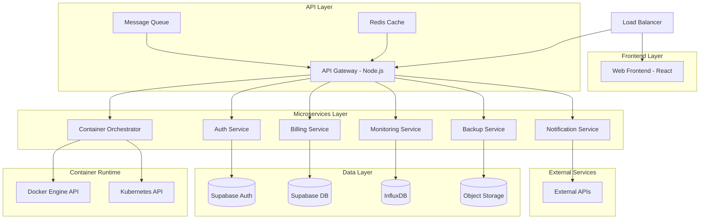
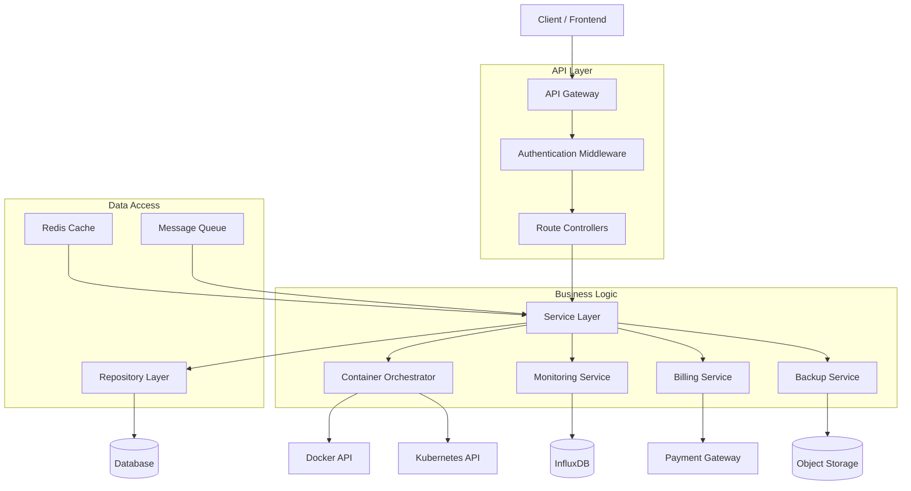
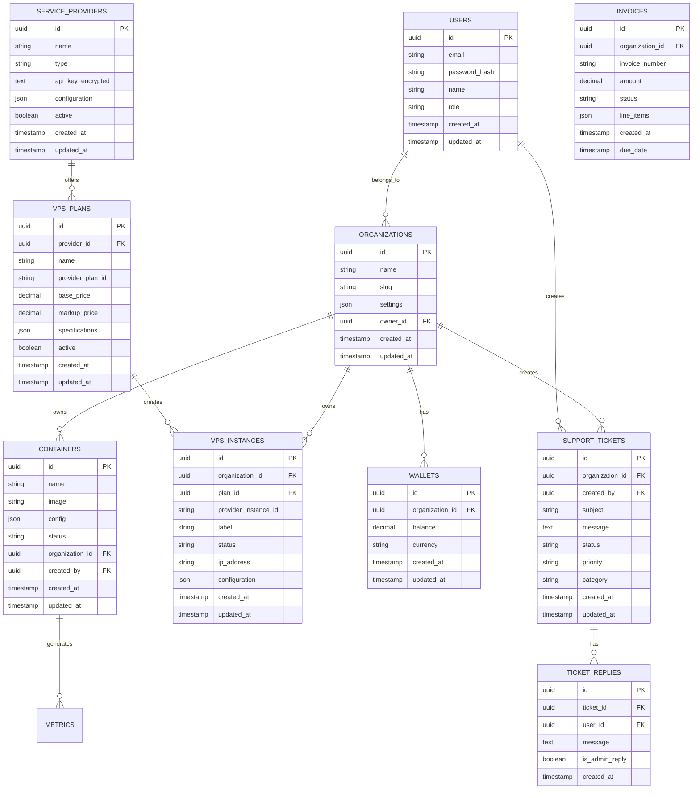

# ContainerStacks - Technical Architecture Document

## 1. Architecture Design



## 2. Technology Description

* **Frontend**: React\@18 + TypeScript + Tailwind CSS + Vite + React Query

* **Backend**: Node.js\@20 + Express\@4 + TypeScript + Docker SDK + Kubernetes Client

* **Database**: Supabase (PostgreSQL) + InfluxDB (metrics) + Redis (caching/sessions)

* **Container Runtime**: Docker Engine + Kubernetes (optional)

* **VPS Integration**: Linode/Akamai API via OpenAPI specification

* **Payment Processing**: PayPal SDK for wallet and invoice payments

* **Email Service**: SMTP2GO for notifications and support tickets

* **Storage**: Supabase Storage (backups) + Docker Registry

* **Message Queue**: Bull Queue (Redis-based)

* **Configuration**: dotenv for environment variables and secrets

* **Monitoring**: Prometheus + Grafana + Custom metrics collection

## 3. Route Definitions

| Route          | Purpose                                                           |
| -------------- | ----------------------------------------------------------------- |
| /              | Landing page with platform overview and login                     |
| /dashboard     | Main dashboard with overview widgets and quick actions            |
| /containers    | Container management interface for deployment and monitoring      |
| /vps           | VPS management for creating instances and managing plans          |
| /marketplace   | Application marketplace for browsing and deploying pre-built apps |
| /billing       | Wallet management, invoices, and PayPal payment processing        |
| /support       | Support ticket system for client-admin communication              |
| /resources     | Resource management for quotas, packages, and usage monitoring    |
| /monitoring    | Monitoring dashboard with metrics, logs, and alerting             |
| /backups       | Backup management for scheduling and restoring container data     |
| /collaboration | Team management and project sharing interface                     |
| /providers     | Service provider management for API keys and cost tracking        |
| /admin         | Administrative panel for platform and user management             |
| /login         | User authentication and login interface                           |
| /register      | User registration and account creation                            |
| /profile       | User profile management and settings                              |

## 4. API Definitions

### 4.1 Core API

**User Authentication**

```
POST /api/auth/login
```

Request:

| Param Name | Param Type | isRequired | Description        |
| ---------- | ---------- | ---------- | ------------------ |
| email      | string     | true       | User email address |
| password   | string     | true       | User password      |

Response:

| Param Name | Param Type | Description              |
| ---------- | ---------- | ------------------------ |
| success    | boolean    | Authentication status    |
| token      | string     | JWT access token         |
| user       | object     | User profile information |

**VPS Management**

```
POST /api/vps/create
```

Request:

| Param Name | Param Type | isRequired | Description         |
| ---------- | ---------- | ---------- | ------------------- |
| plan\_id   | string     | true       | VPS plan identifier |
| region     | string     | true       | Deployment region   |
| label      | string     | true       | VPS instance label  |

Response:

| Param Name  | Param Type | Description             |
| ----------- | ---------- | ----------------------- |
| vps\_id     | string     | Created VPS instance ID |
| status      | string     | Provisioning status     |
| ip\_address | string     | Assigned IP address     |

**Wallet Management**

```
POST /api/billing/wallet/add-funds
```

Request:

| Param Name      | Param Type | isRequired | Description             |
| --------------- | ---------- | ---------- | ----------------------- |
| amount          | number     | true       | Amount to add to wallet |
| payment\_method | string     | true       | PayPal payment method   |

Response:

| Param Name      | Param Type | Description            |
| --------------- | ---------- | ---------------------- |
| transaction\_id | string     | PayPal transaction ID  |
| new\_balance    | number     | Updated wallet balance |

**Support Tickets**

```
POST /api/support/tickets
```

Request:

| Param Name | Param Type | isRequired | Description                       |
| ---------- | ---------- | ---------- | --------------------------------- |
| subject    | string     | true       | Ticket subject                    |
| message    | string     | true       | Ticket message                    |
| priority   | string     | true       | Ticket priority (low/medium/high) |
| category   | string     | true       | Ticket category                   |

Response:

| Param Name | Param Type | Description       |
| ---------- | ---------- | ----------------- |
| ticket\_id | string     | Created ticket ID |
| status     | string     | Ticket status     |

```
POST /api/auth/register
POST /api/auth/logout
GET /api/users/profile
PUT /api/users/profile
```

**Container Management**

```
GET /api/containers
POST /api/containers
GET /api/containers/:id
PUT /api/containers/:id
DELETE /api/containers/:id
POST /api/containers/:id/start
POST /api/containers/:id/stop
POST /api/containers/:id/restart
POST /api/containers/:id/scale
```

Request (Create Container):

| Param Name  | Param Type | isRequired | Description                 |
| ----------- | ---------- | ---------- | --------------------------- |
| name        | string     | true       | Container name              |
| image       | string     | true       | Docker image name and tag   |
| resources   | object     | true       | CPU, memory, storage limits |
| environment | object     | false      | Environment variables       |
| ports       | array      | false      | Port mappings               |
| volumes     | array      | false      | Volume mounts               |

Response:

| Param Name  | Param Type | Description                                |
| ----------- | ---------- | ------------------------------------------ |
| id          | string     | Container unique identifier                |
| status      | string     | Container status (running, stopped, error) |
| created\_at | string     | Creation timestamp                         |
| resources   | object     | Allocated resources                        |

**Image Registry**

```
GET /api/images
POST /api/images/upload
GET /api/images/:id
DELETE /api/images/:id
POST /api/images/build
GET /api/images/build/:id/status
```

**Monitoring & Metrics**

```
GET /api/metrics/containers/:id
GET /api/metrics/system
GET /api/logs/containers/:id
GET /api/alerts
POST /api/alerts
```

**Billing & Usage**

```
GET /api/billing/usage
GET /api/billing/invoices
POST /api/billing/payment-methods
GET /api/billing/plans
```

**Backup Management**

```
GET /api/backups
POST /api/backups
GET /api/backups/:id
POST /api/backups/:id/restore
DELETE /api/backups/:id
```

Example Request (Create Container):

```json
{
  "name": "my-web-app",
  "image": "nginx:latest",
  "resources": {
    "cpu": "0.5",
    "memory": "512Mi",
    "storage": "1Gi"
  },
  "environment": {
    "NODE_ENV": "production"
  },
  "ports": [
    {
      "container": 80,
      "host": 8080
    }
  ]
}
```

## 5. Server Architecture Diagram



## 6. Data Model

### 6.1 Data Model Definition



### 6.2 Data Definition Language

**Core Tables**

```sql
-- Users table for authentication and profile management
CREATE TABLE users (
    id UUID PRIMARY KEY DEFAULT gen_random_uuid(),
    email VARCHAR(255) UNIQUE NOT NULL,
    password_hash VARCHAR(255) NOT NULL,
    name VARCHAR(100) NOT NULL,
    role VARCHAR(20) DEFAULT 'user' CHECK (role IN ('admin', 'user')),
    created_at TIMESTAMP WITH TIME ZONE DEFAULT NOW(),
    updated_at TIMESTAMP WITH TIME ZONE DEFAULT NOW()
);

-- Organizations table for multi-tenancy
CREATE TABLE organizations (
    id UUID PRIMARY KEY DEFAULT gen_random_uuid(),
    name VARCHAR(100) NOT NULL,
    slug VARCHAR(50) UNIQUE NOT NULL,
    owner_id UUID REFERENCES users(id) ON DELETE CASCADE,
    settings JSONB DEFAULT '{}',
    created_at TIMESTAMP WITH TIME ZONE DEFAULT NOW(),
    updated_at TIMESTAMP WITH TIME ZONE DEFAULT NOW()
);

-- Wallets table for account balance management
CREATE TABLE wallets (
    id UUID PRIMARY KEY DEFAULT gen_random_uuid(),
    organization_id UUID REFERENCES organizations(id) ON DELETE CASCADE,
    balance DECIMAL(12,2) DEFAULT 0.00,
    currency VARCHAR(3) DEFAULT 'USD',
    created_at TIMESTAMP WITH TIME ZONE DEFAULT NOW(),
    updated_at TIMESTAMP WITH TIME ZONE DEFAULT NOW()
);

-- Invoices table for billing management
CREATE TABLE invoices (
    id UUID PRIMARY KEY DEFAULT gen_random_uuid(),
    organization_id UUID REFERENCES organizations(id) ON DELETE CASCADE,
    invoice_number VARCHAR(50) UNIQUE NOT NULL,
    amount DECIMAL(10,2) NOT NULL,
    status VARCHAR(20) DEFAULT 'pending' CHECK (status IN ('pending', 'paid', 'overdue', 'cancelled')),
    line_items JSONB DEFAULT '[]',
    created_at TIMESTAMP WITH TIME ZONE DEFAULT NOW(),
    due_date TIMESTAMP WITH TIME ZONE NOT NULL
);

-- Support tickets table
CREATE TABLE support_tickets (
    id UUID PRIMARY KEY DEFAULT gen_random_uuid(),
    organization_id UUID REFERENCES organizations(id) ON DELETE CASCADE,
    created_by UUID REFERENCES users(id) ON DELETE CASCADE,
    subject VARCHAR(255) NOT NULL,
    message TEXT NOT NULL,
    status VARCHAR(20) DEFAULT 'open' CHECK (status IN ('open', 'in_progress', 'resolved', 'closed')),
    priority VARCHAR(10) DEFAULT 'medium' CHECK (priority IN ('low', 'medium', 'high', 'urgent')),
    category VARCHAR(50) NOT NULL,
    created_at TIMESTAMP WITH TIME ZONE DEFAULT NOW(),
    updated_at TIMESTAMP WITH TIME ZONE DEFAULT NOW()
);

-- Ticket replies table
CREATE TABLE ticket_replies (
    id UUID PRIMARY KEY DEFAULT gen_random_uuid(),
    ticket_id UUID REFERENCES support_tickets(id) ON DELETE CASCADE,
    user_id UUID REFERENCES users(id) ON DELETE CASCADE,
    message TEXT NOT NULL,
    is_admin_reply BOOLEAN DEFAULT FALSE,
    created_at TIMESTAMP WITH TIME ZONE DEFAULT NOW()
);

-- Service providers table for cloud provider integration
CREATE TABLE service_providers (
    id UUID PRIMARY KEY DEFAULT gen_random_uuid(),
    name VARCHAR(100) NOT NULL,
    type VARCHAR(50) NOT NULL CHECK (type IN ('linode', 'digitalocean', 'aws', 'gcp')),
    api_key_encrypted TEXT NOT NULL,
    configuration JSONB DEFAULT '{}',
    active BOOLEAN DEFAULT TRUE,
    created_at TIMESTAMP WITH TIME ZONE DEFAULT NOW(),
    updated_at TIMESTAMP WITH TIME ZONE DEFAULT NOW()
);

-- VPS plans table for reseller functionality
CREATE TABLE vps_plans (
    id UUID PRIMARY KEY DEFAULT gen_random_uuid(),
    provider_id UUID REFERENCES service_providers(id) ON DELETE CASCADE,
    name VARCHAR(100) NOT NULL,
    provider_plan_id VARCHAR(100) NOT NULL,
    base_price DECIMAL(10,2) NOT NULL,
    markup_price DECIMAL(10,2) NOT NULL,
    specifications JSONB DEFAULT '{}',
    active BOOLEAN DEFAULT TRUE,
    created_at TIMESTAMP WITH TIME ZONE DEFAULT NOW(),
    updated_at TIMESTAMP WITH TIME ZONE DEFAULT NOW()
);

-- VPS instances table
CREATE TABLE vps_instances (
    id UUID PRIMARY KEY DEFAULT gen_random_uuid(),
    organization_id UUID REFERENCES organizations(id) ON DELETE CASCADE,
    plan_id UUID REFERENCES vps_plans(id) ON DELETE RESTRICT,
    provider_instance_id VARCHAR(100) NOT NULL,
    label VARCHAR(100) NOT NULL,
    status VARCHAR(20) DEFAULT 'provisioning',
    ip_address INET,
    configuration JSONB DEFAULT '{}',
    created_at TIMESTAMP WITH TIME ZONE DEFAULT NOW(),
    updated_at TIMESTAMP WITH TIME ZONE DEFAULT NOW()
);

-- Containers table
CREATE TABLE containers (
    id UUID PRIMARY KEY DEFAULT gen_random_uuid(),
    name VARCHAR(100) NOT NULL,
    image VARCHAR(255) NOT NULL,
    organization_id UUID REFERENCES organizations(id) ON DELETE CASCADE,
    config JSONB DEFAULT '{}',
    status VARCHAR(20) DEFAULT 'stopped',
    created_by UUID REFERENCES users(id) ON DELETE SET NULL,
    created_at TIMESTAMP WITH TIME ZONE DEFAULT NOW(),
    updated_at TIMESTAMP WITH TIME ZONE DEFAULT NOW()
);

-- Indexes for performance
CREATE INDEX idx_wallets_organization_id ON wallets(organization_id);
CREATE INDEX idx_invoices_organization_id ON invoices(organization_id);
CREATE INDEX idx_support_tickets_organization_id ON support_tickets(organization_id);
CREATE INDEX idx_support_tickets_status ON support_tickets(status);
CREATE INDEX idx_ticket_replies_ticket_id ON ticket_replies(ticket_id);
CREATE INDEX idx_vps_instances_organization_id ON vps_instances(organization_id);
CREATE INDEX idx_vps_instances_plan_id ON vps_instances(plan_id);
CREATE INDEX idx_containers_organization_id ON containers(organization_id);

-- Row Level Security
ALTER TABLE organizations ENABLE ROW LEVEL SECURITY;
ALTER TABLE wallets ENABLE ROW LEVEL SECURITY;
ALTER TABLE invoices ENABLE ROW LEVEL SECURITY;
ALTER TABLE support_tickets ENABLE ROW LEVEL SECURITY;
ALTER TABLE ticket_replies ENABLE ROW LEVEL SECURITY;
ALTER TABLE vps_instances ENABLE ROW LEVEL SECURITY;
ALTER TABLE containers ENABLE ROW LEVEL SECURITY;

-- RLS Policies
CREATE POLICY "Users can view their own organizations" ON organizations
    FOR SELECT USING (owner_id = auth.uid());

CREATE POLICY "Users can manage their organization's resources" ON wallets
    FOR ALL USING (organization_id IN (
        SELECT id FROM organizations WHERE owner_id = auth.uid()
    ));

CREATE POLICY "Users can view their organization's invoices" ON invoices
    FOR SELECT USING (organization_id IN (
        SELECT id FROM organizations WHERE owner_id = auth.uid()
    ));

CREATE POLICY "Users can manage their organization's tickets" ON support_tickets
    FOR ALL USING (organization_id IN (
        SELECT id FROM organizations WHERE owner_id = auth.uid()
    ));
```

