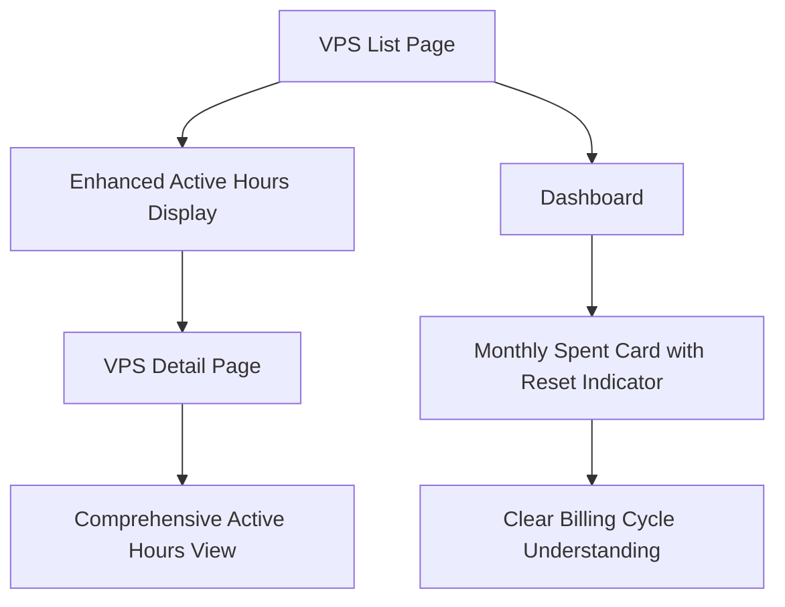

# Active Hours Enhancement & Monthly Reset Indicator - Product Requirements Document

## 1. Product Overview

This enhancement focuses on improving the visibility and user experience of critical billing metrics in the ContainerStacks platform. The project addresses two key areas: making Active Hours more prominent across VPS interfaces and adding a monthly reset indicator to the dashboard's spending card.

The enhancement will help users better track their VPS usage costs and understand billing cycles, ultimately improving transparency and user confidence in the platform's billing system.

## 2. Core Features

### 2.1 User Roles

| Role | Registration Method | Core Permissions |
|------|---------------------|------------------|
| Regular User | Email registration | Can view own VPS instances, active hours, and billing information |
| Admin User | Admin invitation | Can view all VPS instances and billing data across organizations |

### 2.2 Feature Module

Our enhancement requirements consist of the following main areas:
1. **VPS Table Enhancement**: improved Active Hours display with visual prominence and accessibility features.
2. **VPS Detail Enhancement**: enhanced Active Hours presentation with better visual hierarchy and responsive design.
3. **Dashboard Monthly Indicator**: new monthly reset indicator with date/time information and smooth transitions.

### 2.3 Page Details

| Page Name | Module Name | Feature description |
|-----------|-------------|---------------------|
| VPS List (/vps) | Active Hours Column | Enhanced visual display with icon, improved typography, color coding for different hour ranges, tooltip with additional context |
| VPS List (/vps) | Mobile Cards | Prominent Active Hours display in mobile view with visual emphasis and proper spacing |
| VPS Detail (/vps/:id) | Active Hours Section | Redesigned Active Hours display with icon, enhanced styling, better contrast, and responsive layout |
| Dashboard (/dashboard) | Monthly Spent Card | New reset indicator showing month start date, visual reset badge, smooth transitions, and consistent design language |

## 3. Core Process

**Regular User Flow:**
1. User navigates to VPS list page and immediately notices enhanced Active Hours display
2. User can quickly identify high-usage instances through visual indicators
3. User clicks on VPS detail to see comprehensive Active Hours information
4. User visits dashboard to view monthly spending with clear reset indicator
5. User understands billing cycle through visual reset date information

**Admin User Flow:**
1. Admin accesses VPS management with enhanced visibility across all instances
2. Admin can quickly assess usage patterns through improved Active Hours display
3. Admin monitors organizational spending with clear monthly reset indicators

## 4. User Interface Design

### 4.1 Design Style

- **Primary Colors**: Maintain existing orange (#f97316) for billing-related elements, blue (#3b82f6) for informational elements
- **Secondary Colors**: Green (#10b981) for positive metrics, amber (#f59e0b) for warnings
- **Typography**: Enhanced font weights (medium/semibold) for Active Hours, consistent with existing card typography
- **Visual Elements**: Clock icons for Active Hours, calendar icons for reset indicators, subtle badges and pills
- **Transitions**: 200ms ease-in-out for hover states, 300ms for state changes
- **Accessibility**: Minimum 4.5:1 contrast ratio, proper ARIA labels, keyboard navigation support

### 4.2 Page Design Overview

| Page Name | Module Name | UI Elements |
|-----------|-------------|-------------|
| VPS List | Active Hours Column | Clock icon (16px), enhanced typography (font-medium), color-coded background (subtle), tooltip with creation date and cost estimate |
| VPS List | Mobile Cards | Prominent Active Hours section with icon, larger text (text-sm), visual separation from other metrics |
| VPS Detail | Active Hours Display | Clock icon (20px), larger typography (text-base), enhanced contrast, responsive grid layout |
| Dashboard | Monthly Spent Card | Reset badge with calendar icon, "Reset on [date]" text, subtle animation on month change, consistent card styling |

### 4.3 Responsiveness

The enhancement is designed mobile-first with adaptive layouts:
- **Mobile (< 640px)**: Stacked layouts, larger touch targets, simplified visual indicators
- **Tablet (640px - 1024px)**: Balanced layouts with appropriate spacing
- **Desktop (> 1024px)**: Full feature display with enhanced visual hierarchy
- **Touch Optimization**: Minimum 44px touch targets, hover states adapted for touch devices

## 5. Technical Requirements

### 5.1 Performance Considerations

- Active Hours calculations cached to prevent repeated computations
- Smooth transitions using CSS transforms and opacity
- Lazy loading for tooltip content
- Optimized re-renders using React.memo where appropriate

### 5.2 Accessibility Standards

- WCAG 2.1 AA compliance
- Screen reader support with proper ARIA labels
- Keyboard navigation for all interactive elements
- High contrast mode compatibility
- Focus indicators for all focusable elements

### 5.3 Browser Compatibility

- Modern browsers (Chrome 90+, Firefox 88+, Safari 14+, Edge 90+)
- Progressive enhancement for older browsers
- Graceful degradation of visual enhancements

## 6. Success Metrics

- **User Engagement**: 25% increase in VPS detail page views
- **User Understanding**: Reduced support tickets related to billing confusion by 30%
- **Accessibility**: 100% compliance with WCAG 2.1 AA standards
- **Performance**: No measurable impact on page load times
- **User Satisfaction**: Positive feedback on enhanced visibility in user surveys