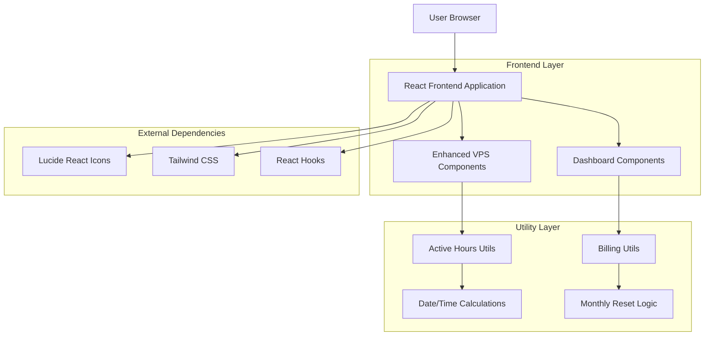

# Active Hours Enhancement & Monthly Reset Indicator - Technical Architecture Document

## 1. Architecture Design



## 2. Technology Description

* **Frontend**: React\@18 + TypeScript + Tailwind CSS + Vite

* **Icons**: Lucide React for consistent iconography

* **Styling**: Tailwind CSS with custom utility classes

* **State Management**: React hooks (useState, useEffect, useMemo)

* **Animations**: CSS transitions and Tailwind animation utilities

## 3. Route Definitions

| Route      | Purpose                                                 | Enhanced Components         |
| ---------- | ------------------------------------------------------- | --------------------------- |
| /vps       | VPS instances list with enhanced Active Hours display   | VpsTable, VpsCard (mobile)  |
| /vps/:id   | VPS instance detail with prominent Active Hours section | VPSDetail                   |
| /dashboard | Dashboard with monthly reset indicator on spending card | Dashboard, MonthlySpentCard |

## 4. Component Architecture

### 4.1 Enhanced Components

**VpsTable Component Enhancements**

```typescript
interface ActiveHoursDisplayProps {
  hours: number;
  createdAt: string;
  status: 'running' | 'stopped' | 'provisioning';
  showTooltip?: boolean;
}

interface MonthlyResetIndicatorProps {
  monthlySpend: number;
  resetDate: Date;
  showAnimation?: boolean;
}
```

**Component Structure**

```
src/components/
├── VPS/
│   ├── VpsTable.tsx (enhanced)
│   ├── ActiveHoursDisplay.tsx (new)
│   └── VpsCard.tsx (enhanced mobile)
├── Dashboard/
│   ├── MonthlySpentCard.tsx (enhanced)
│   └── MonthlyResetIndicator.tsx (new)
└── ui/
    ├── Badge.tsx (existing)
    ├── Tooltip.tsx (existing)
    └── Card.tsx (existing)
```

### 4.2 Utility Functions

**Active Hours Utilities**

```typescript
// Enhanced active hours calculation with formatting
export const calculateActiveHoursEnhanced = (createdAt: string | null): {
  hours: number;
  formatted: string;
  colorClass: string;
  urgencyLevel: 'low' | 'medium' | 'high';
} => {
  // Implementation details
};

// Monthly reset utilities
export const getMonthlyResetInfo = (): {
  resetDate: Date;
  daysIntoMonth: number;
  isNewMonth: boolean;
} => {
  // Implementation details
};
```

## 5. Data Model

### 5.1 Enhanced Data Structures

**Active Hours Enhancement Data**

```typescript
interface EnhancedActiveHours {
  hours: number;
  formatted: string;
  createdAt: string;
  estimatedCost: number;
  urgencyLevel: 'low' | 'medium' | 'high';
  colorClass: string;
}

interface MonthlyResetData {
  resetDate: Date;
  currentSpend: number;
  daysIntoMonth: number;
  isNewMonth: boolean;
  previousMonthSpend?: number;
}
```

## 6. Implementation Details

### 6.1 Active Hours Enhancement

**VPS Table Column Enhancement**

* Add Clock icon from Lucide React

* Implement color-coded backgrounds based on usage levels

* Add tooltip with additional context (creation date, estimated cost)

* Enhance typography with medium font weight

* Implement responsive behavior for mobile/desktop

**VPS Detail Page Enhancement**

* Redesign Active Hours section with prominent display

* Add visual hierarchy with icons and enhanced spacing

* Implement responsive grid layout

* Add smooth transitions for state changes

### 6.2 Monthly Reset Indicator

**Dashboard Card Enhancement**

* Add reset indicator badge with calendar icon

* Display "Reset on \[date]" information

* Implement smooth animations for month transitions

* Maintain consistency with existing card design

* Add accessibility features (ARIA labels, screen reader support)

### 6.3 Styling Implementation

**Tailwind CSS Classes**

```css
/* Active Hours Enhanced Display */
.active-hours-enhanced {
  @apply flex items-center gap-2 font-medium text-foreground;
}

.active-hours-low {
  @apply bg-green-50 dark:bg-green-900/20 text-green-700 dark:text-green-300;
}

.active-hours-medium {
  @apply bg-amber-50 dark:bg-amber-900/20 text-amber-700 dark:text-amber-300;
}

.active-hours-high {
  @apply bg-red-50 dark:bg-red-900/20 text-red-700 dark:text-red-300;
}

/* Monthly Reset Indicator */
.monthly-reset-indicator {
  @apply flex items-center gap-1 text-xs text-muted-foreground;
  @apply transition-all duration-300 ease-in-out;
}

.reset-badge {
  @apply inline-flex items-center gap-1 px-2 py-1 rounded-full;
  @apply bg-blue-100 dark:bg-blue-900/20 text-blue-700 dark:text-blue-300;
}
```

### 6.4 Accessibility Implementation

**ARIA Labels and Screen Reader Support**

```typescript
// Active Hours accessibility
<div 
  className="active-hours-enhanced"
  aria-label={`Active for ${formattedHours} hours since ${creationDate}`}
  role="status"
>
  <Clock className="h-4 w-4" aria-hidden="true" />
  <span>{formattedHours}</span>
</div>

// Monthly reset indicator accessibility
<div 
  className="monthly-reset-indicator"
  aria-label={`Monthly spending resets on ${resetDate.toLocaleDateString()}`}
  role="status"
>
  <Calendar className="h-3 w-3" aria-hidden="true" />
  <span>Reset on {resetDate.toLocaleDateString()}</span>
</div>
```

### 6.5 Performance Optimizations

**Memoization and Optimization**

```typescript
// Memoized active hours calculation
const activeHoursData = useMemo(() => 
  calculateActiveHoursEnhanced(instance.createdAt), 
  [instance.createdAt]
);

// Optimized monthly reset calculation
const monthlyResetInfo = useMemo(() => 
  getMonthlyResetInfo(), 
  [new Date().getMonth()]
);
```

## 7. Testing Strategy

### 7.1 Unit Tests

* Active hours calculation accuracy

* Monthly reset date calculations

* Component rendering with various props

* Accessibility compliance testing

### 7.2 Integration Tests

* VPS table with enhanced Active Hours display

* Dashboard with monthly reset indicator

* Responsive behavior across device sizes

* Theme switching (light/dark mode)

### 7.3 Visual Regression Tests

* Screenshot comparisons for enhanced components

* Cross-browser compatibility testing

* Mobile responsiveness validation

## 8. Deployment Considerations

### 8.1 Feature Flags

* Gradual rollout capability for enhanced Active Hours display

* A/B testing support for monthly reset indicator

* Fallback to original display if issues arise

### 8.2 Performance Monitoring

* Monitor component render times

* Track user interaction with enhanced elements

* Measure accessibility compliance metrics

### 8.3 Browser Support

* Progressive enhancement for older browsers

* Graceful degradation of visual enhancements

* Polyfills for CSS features if needed

