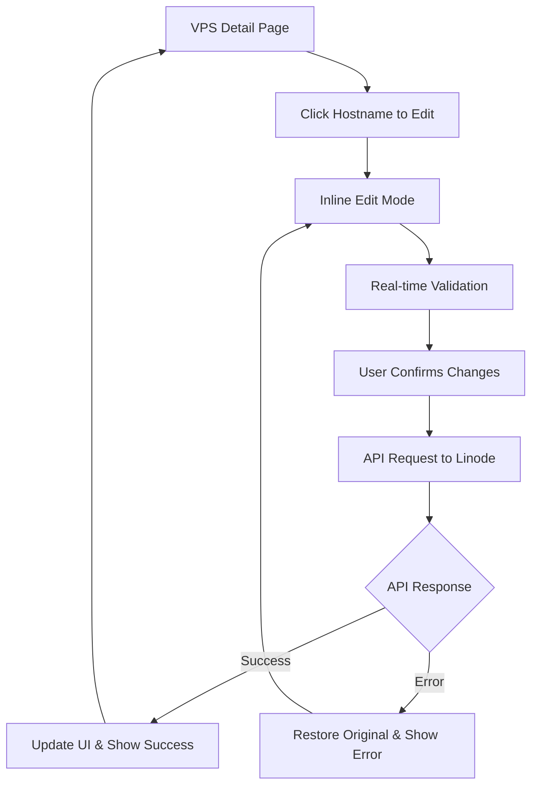

# VPS Hostname Editing Feature - Product Requirements Document

## 1. Product Overview

This feature enables users to edit VPS hostname directly from the VPS detail page with real-time updates via Linode's official API. Users can modify the hostname inline, providing immediate feedback and seamless integration with the existing ContainerStacks platform.

The feature addresses the need for quick hostname management without navigating to external provider interfaces, enhancing user experience and operational efficiency for VPS management workflows.

## 2. Core Features

### 2.1 User Roles

| Role | Registration Method | Core Permissions |
|------|---------------------|------------------|
| Organization Member | Email registration with organization invitation | Can view and edit VPS hostnames for instances within their organization |
| Organization Admin | Email registration as organization owner | Full access to all VPS management features including hostname editing |

### 2.2 Feature Module

Our hostname editing feature consists of the following main components:
1. **VPS Detail Page**: Enhanced hostname display with inline editing capability, validation feedback, and API integration.
2. **API Integration Layer**: Secure communication with Linode API for hostname updates, error handling, and status synchronization.

### 2.3 Page Details

| Page Name | Module Name | Feature description |
|-----------|-------------|---------------------|
| VPS Detail Page | Hostname Display & Edit | Convert static h1 hostname to editable field with click-to-edit functionality. Validate input (3-64 characters, alphanumeric with hyphens, underscores, periods). Show loading states during API calls. |
| VPS Detail Page | API Integration | Integrate with Linode PUT /v4/linode/instances/{linodeId} endpoint to update label field. Handle authentication, request/response processing, and error states. |
| VPS Detail Page | User Feedback | Display success/error messages, loading indicators, and validation warnings. Provide real-time feedback during hostname update process. |

## 3. Core Process

**Main User Flow:**
1. User navigates to VPS detail page and views current hostname
2. User clicks on hostname to enter edit mode (inline editing)
3. System validates input in real-time as user types
4. User confirms changes by pressing Enter or clicking save
5. System sends secure API request to Linode to update hostname
6. System displays loading state and processes API response
7. On success: hostname updates immediately, success message shown
8. On error: original hostname restored, error message displayed with retry option

## 4. User Interface Design

### 4.1 Design Style

- **Primary Colors**: Blue (#3B82F6) for interactive elements, Green (#10B981) for success states
- **Secondary Colors**: Gray (#6B7280) for text, Red (#EF4444) for error states
- **Button Style**: Rounded corners (8px), subtle shadows, hover state transitions
- **Font**: System font stack with 16px base size for hostname display, 14px for validation messages
- **Layout Style**: Inline editing with smooth transitions, card-based layout consistency
- **Icons**: Lucide React icons for edit, save, cancel, and status indicators

### 4.2 Page Design Overview

| Page Name | Module Name | UI Elements |
|-----------|-------------|-------------|
| VPS Detail Page | Hostname Display | Large h1 text (24px) with server icon, hover state shows edit cursor, click reveals input field with save/cancel buttons |
| VPS Detail Page | Edit Mode | Input field with same styling as h1, character counter (3-64), real-time validation border colors, save/cancel icon buttons |
| VPS Detail Page | Feedback States | Loading spinner overlay, success toast (green), error toast (red), validation messages below input field |

### 4.3 Responsiveness

The feature is designed mobile-first with touch-friendly edit controls. Hostname editing works seamlessly on desktop and mobile devices with appropriate touch targets and responsive typography scaling.
