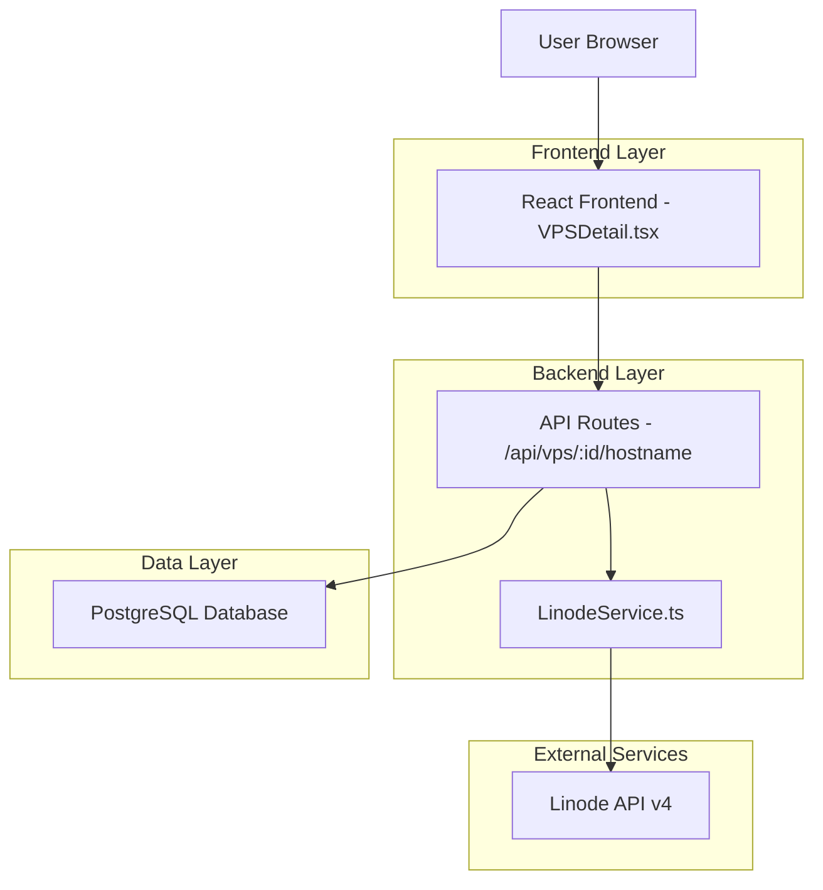
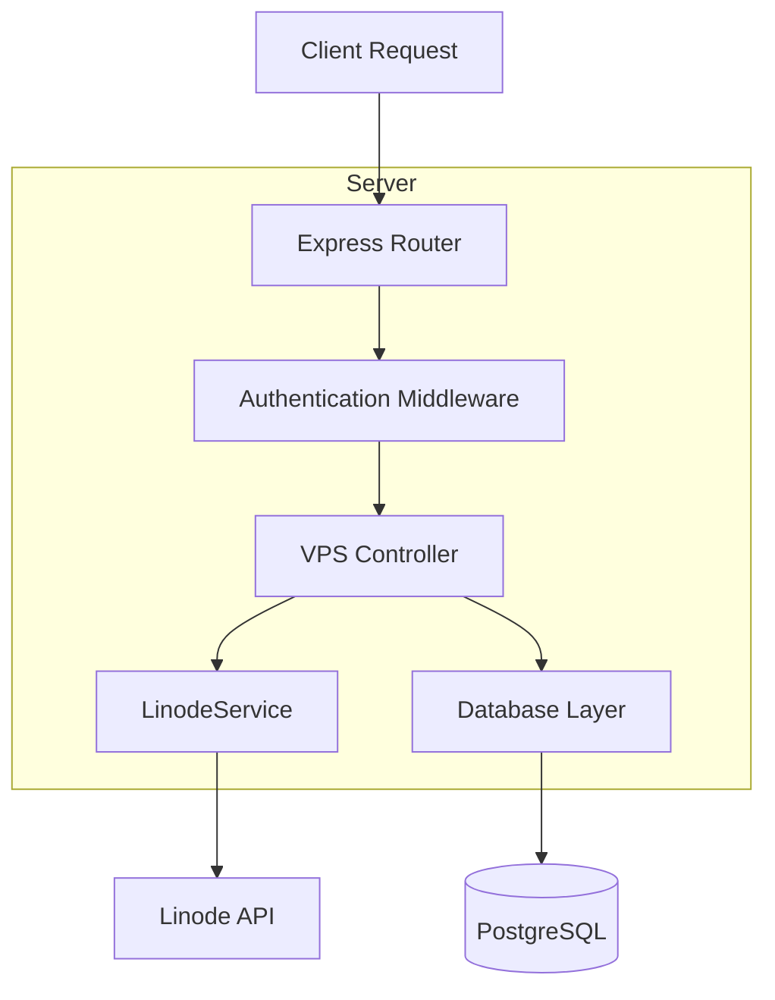
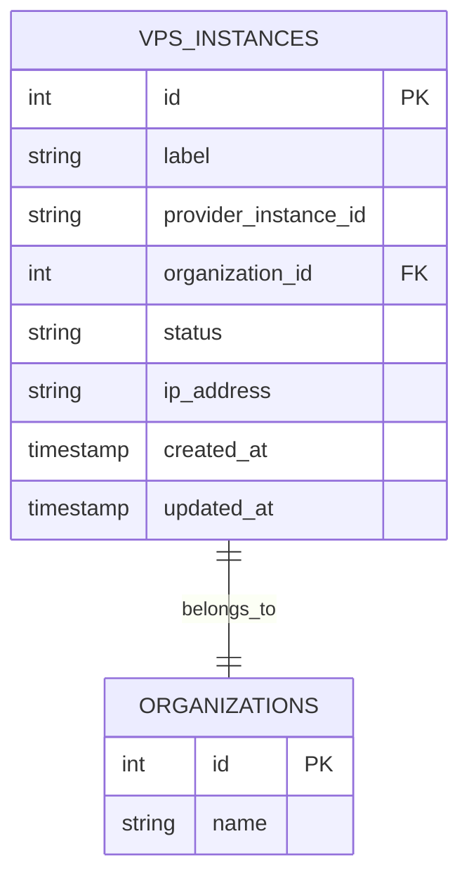

# VPS Hostname Editing - Technical Architecture Document

## 1. Architecture design



## 2. Technology Description

- Frontend: React@18 + TypeScript + TailwindCSS@3 + Vite
- Backend: Express@4 + Node.js + TypeScript
- Database: PostgreSQL (existing vps_instances table)
- External API: Linode API v4 (PUT /v4/linode/instances/{linodeId})

## 3. Route definitions

| Route | Purpose |
|-------|---------|
| /vps/:id | VPS detail page with hostname editing functionality |
| /api/vps/:id/hostname | API endpoint for updating VPS hostname via Linode API |

## 4. API definitions

### 4.1 Core API

VPS hostname update endpoint
```
PUT /api/vps/:id/hostname
```

Request:
| Param Name| Param Type  | isRequired  | Description |
|-----------|-------------|-------------|-------------|
| hostname  | string      | true        | New hostname (3-64 characters, alphanumeric with hyphens, underscores, periods) |

Response:
| Param Name| Param Type  | Description |
|-----------|-------------|-------------|
| success   | boolean     | Whether the update was successful |
| hostname  | string      | Updated hostname value |
| message   | string      | Success or error message |

Example Request:
```json
{
  "hostname": "my-new-server-name"
}
```

Example Response:
```json
{
  "success": true,
  "hostname": "my-new-server-name",
  "message": "Hostname updated successfully"
}
```

### 4.2 Linode API Integration

The backend will call Linode's API:
```
PUT https://api.linode.com/v4/linode/instances/{linodeId}
```

Request Body:
```json
{
  "label": "my-new-server-name"
}
```

## 5. Server architecture diagram



## 6. Data model

### 6.1 Data model definition



### 6.2 Data Definition Language

VPS Instances Table (existing - no changes needed)
```sql
-- The existing vps_instances table already contains the label field
-- which stores the hostname/label information

-- Update query for hostname changes
UPDATE vps_instances 
SET label = $1, updated_at = NOW() 
WHERE id = $2 AND organization_id = $3;

-- Index for efficient lookups (if not exists)
CREATE INDEX IF NOT EXISTS idx_vps_instances_org_id ON vps_instances(organization_id);
CREATE INDEX IF NOT EXISTS idx_vps_instances_provider_id ON vps_instances(provider_instance_id);
```

### 6.3 Implementation Details

**Frontend Changes (VPSDetail.tsx):**
- Convert static h1 hostname display to editable component
- Add inline editing with click-to-edit functionality
- Implement real-time validation for hostname format
- Add loading states and error handling
- Integrate with new API endpoint

**Backend Changes:**
- Add new route: `PUT /api/vps/:id/hostname`
- Extend LinodeService with `updateLinodeInstance` method
- Add hostname validation middleware
- Update database record after successful API call
- Implement proper error handling and logging

**Security Considerations:**
- Validate user permissions for VPS instance access
- Sanitize and validate hostname input
- Use existing authentication middleware
- Secure API token handling for Linode API calls
- Rate limiting for hostname update requests

**Error Handling:**
- Network connectivity issues with Linode API
- Invalid hostname format validation
- Unauthorized access attempts
- Linode API rate limiting
- Database update failures