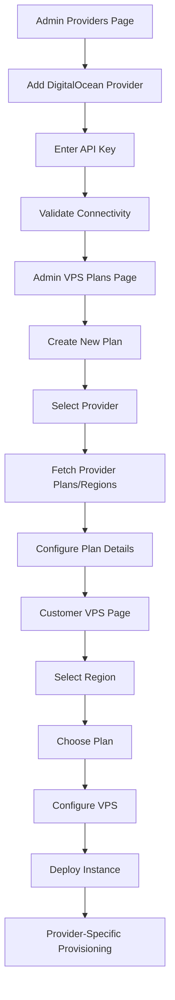

# Multi-Provider VPS Integration - Product Requirements Document

## 1. Product Overview

ContainerStacks will expand from a single-provider (Linode) VPS hosting platform to a multi-provider solution supporting both Linode and DigitalOcean. This enhancement enables administrators to configure multiple VPS providers, create provider-specific plans with distinct regions and pricing, while maintaining a seamless white-labeled experience for end customers.

The integration addresses scalability, redundancy, and competitive pricing by leveraging multiple cloud infrastructure providers while preserving the existing user experience and administrative workflows.

## 2. Core Features

### 2.1 User Roles

| Role | Registration Method | Core Permissions |
|------|---------------------|------------------|
| Admin | System-level access | Full provider management, API key configuration, VPS plan creation across all providers |
| End Customer | Email registration | VPS deployment, management, and monitoring (provider-agnostic interface) |

### 2.2 Feature Module

Our multi-provider VPS requirements consist of the following main pages:

1. **Admin Providers Page** (`/admin#providers`): Provider configuration, API key management, provider status monitoring.
2. **Admin VPS Plans Page** (`/admin#vps-plans`): Enhanced plan creation with provider selection, region-specific pricing, plan specifications.
3. **Customer VPS Deployment Page** (`/vps`): Region-based plan selection, provider-agnostic deployment interface.
4. **VPS Management Dashboard**: Instance monitoring, lifecycle management (existing functionality enhanced).

### 2.3 Page Details

| Page Name | Module Name | Feature description |
|-----------|-------------|---------------------|
| Admin Providers | Provider Configuration | Add/edit/delete providers (Linode, DigitalOcean). Store encrypted API keys. Test provider connectivity. View provider status and capabilities. |
| Admin Providers | API Key Management | Secure storage of provider API tokens. Validation of API key permissions. Key rotation and expiration tracking. |
| Admin VPS Plans | Provider Selection | Dropdown to select between configured providers. Dynamic loading of provider-specific plans and regions. |
| Admin VPS Plans | Plan Creation | Fetch upstream plans from selected provider. Configure markup pricing. Set region availability. Define plan specifications (CPU, RAM, disk, transfer). |
| Admin VPS Plans | Region Management | Provider-specific region filtering. Region availability configuration. Pricing variations by region. |
| Customer VPS Deployment | Region Selector | Display available regions based on configured plans. Filter plans by selected region. Hide provider branding (white-label). |
| Customer VPS Deployment | Plan Selection | Show available plans for selected region. Display pricing, specifications. Provider-agnostic plan presentation. |
| Customer VPS Deployment | Instance Creation | Deploy VPS using selected plan and region. Automatic provider routing based on plan configuration. Progress tracking and status updates. |
| VPS Management | Multi-Provider Support | Unified instance management regardless of underlying provider. Provider-specific API calls for lifecycle operations. Consistent status normalization across providers. |

## 3. Core Process

### Admin Flow
1. **Provider Setup**: Admin navigates to `/admin#providers` → Adds new DigitalOcean provider → Enters API key → System validates connectivity
2. **Plan Configuration**: Admin goes to `/admin#vps-plans` → Clicks "Add VPS Plan" → Selects provider (Linode/DigitalOcean) → System fetches provider plans and regions → Admin selects plan type and region → Sets pricing and availability → Saves plan
3. **Plan Management**: Admin can edit existing plans, adjust pricing, enable/disable plans, and monitor provider status

### Customer Flow
1. **Region Selection**: Customer visits `/vps` → Selects desired region from dropdown → System filters available plans for that region
2. **Plan Selection**: Customer reviews available plans with specifications and pricing → Selects preferred plan → Proceeds to configuration
3. **VPS Deployment**: Customer configures VPS settings (hostname, SSH keys, etc.) → Submits deployment → System routes to appropriate provider → VPS is provisioned → Customer receives access details

## 4. User Interface Design

### 4.1 Design Style

- **Primary Colors**: Blue (#3B82F6) for primary actions, Gray (#6B7280) for secondary elements
- **Button Style**: Rounded corners (8px), subtle shadows, hover state transitions
- **Font**: Inter font family, 14px base size for body text, 16px for headings
- **Layout Style**: Card-based design with clean borders, consistent spacing (16px/24px grid)
- **Icons**: Lucide React icons for consistency, provider logos for brand recognition in admin areas only

### 4.2 Page Design Overview

| Page Name | Module Name | UI Elements |
|-----------|-------------|-------------|
| Admin Providers | Provider List | Card layout with provider logos, status indicators (green/red), API key status, action buttons (Edit/Delete/Test). |
| Admin Providers | Add Provider Form | Modal dialog with provider type selector, API key input field, connection test button, save/cancel actions. |
| Admin VPS Plans | Enhanced Plan Modal | Multi-step form: 1) Provider selection dropdown, 2) Plan type selection (fetched from provider), 3) Region selection, 4) Pricing configuration, 5) Specifications review. |
| Admin VPS Plans | Plan List Table | Sortable table with columns: Plan Name, Provider (with icon), Region, Specifications, Pricing, Status, Actions. |
| Customer VPS Deployment | Region Selector | Prominent dropdown at top of page, with region flags/icons, availability indicators. |
| Customer VPS Deployment | Plan Cards | Grid layout of plan cards showing CPU/RAM/Disk specs, pricing, "Select Plan" button. No provider branding visible. |
| Customer VPS Deployment | Deployment Form | Clean form with hostname input, SSH key management, OS selection, additional options. Progress indicator during deployment. |

### 4.3 Responsiveness

The application is desktop-first with mobile-adaptive design. Touch interaction optimization is implemented for mobile devices. The admin interface prioritizes desktop experience while the customer VPS deployment page is fully responsive for mobile provisioning.

Key responsive breakpoints:
- Desktop: 1024px+ (full feature set)
- Tablet: 768px-1023px (adapted layouts)
- Mobile: <768px (stacked layouts, simplified navigation)