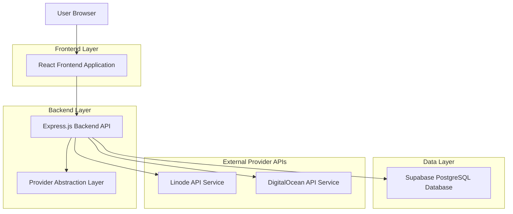
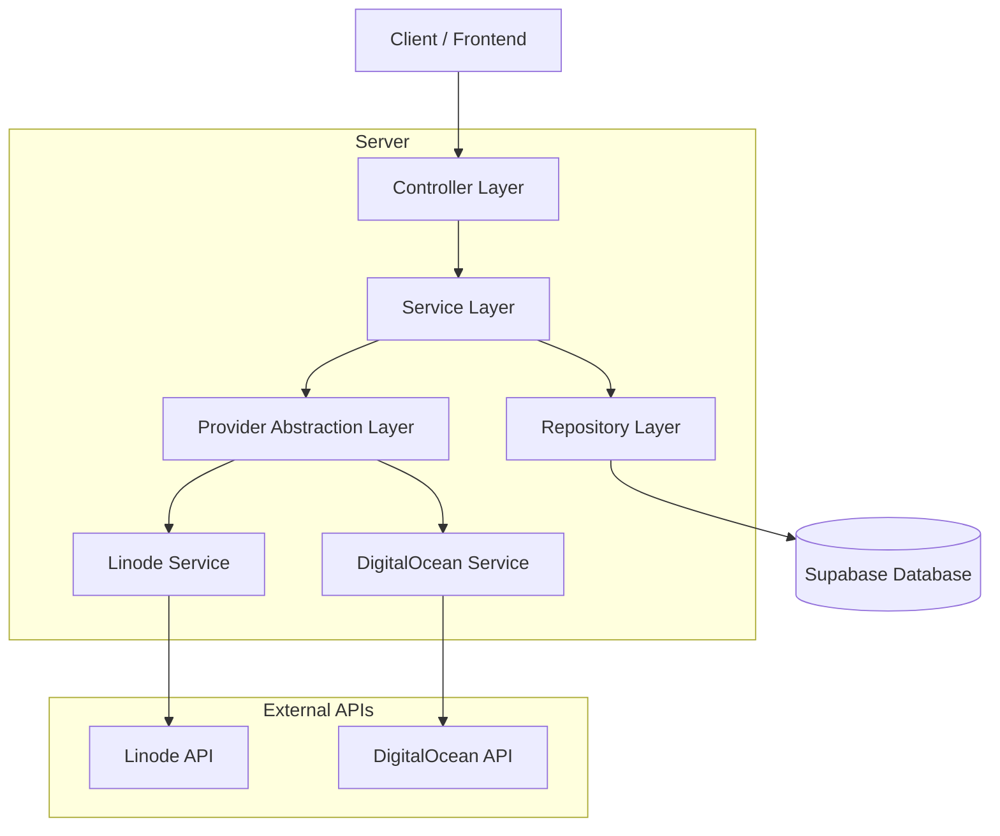
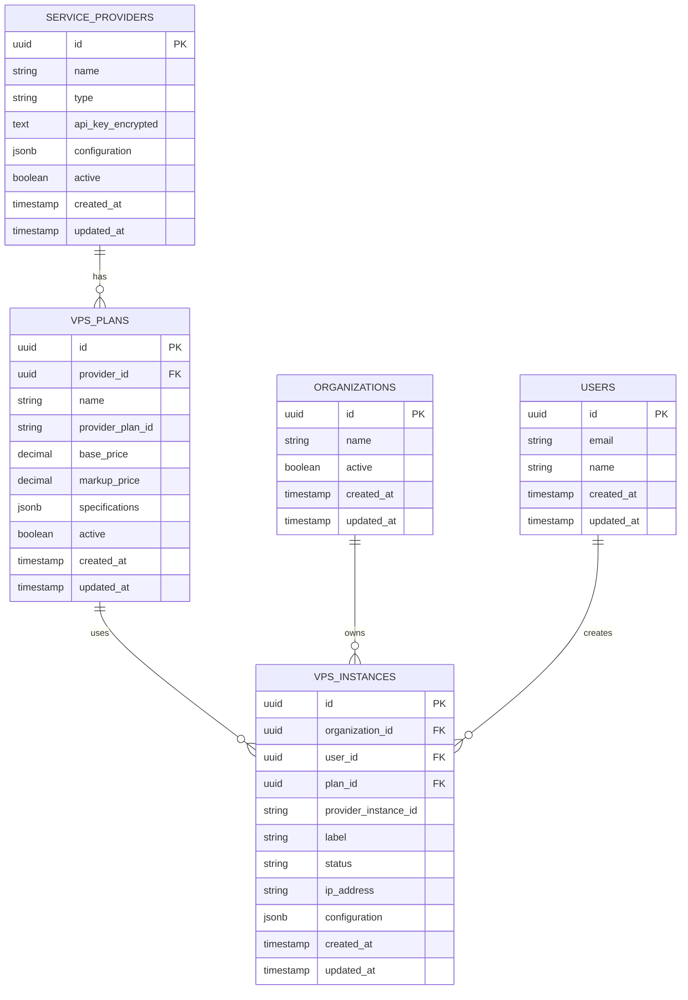

# Multi-Provider VPS Integration - Technical Architecture Document

## 1. Architecture Design



## 2. Technology Description

* **Frontend**: React\@18 + TypeScript + Tailwind CSS + Vite + shadcn/ui

* **Backend**: Node.js + Express\@4 + TypeScript

* **Database**: Supabase (PostgreSQL)

* **External APIs**: Linode API v4, DigitalOcean API v2

* **Authentication**: Supabase Auth

* **Validation**: express-validator (backend), zod (frontend)

## 3. Route Definitions

| Route              | Purpose                                                                                       |
| ------------------ | --------------------------------------------------------------------------------------------- |
| `/admin#providers` | Provider management interface for configuring Linode and DigitalOcean API keys                |
| `/admin#vps-plans` | Enhanced VPS plan creation with multi-provider support and region-specific configuration      |
| `/vps`             | Customer VPS deployment page with region-based plan filtering and provider-agnostic interface |
| `/vps/:id`         | VPS instance management and monitoring (enhanced for multi-provider support)                  |

## 4. API Definitions

### 4.1 Core API

**Provider Management**

```
GET /api/admin/providers
```

Response:

| Param Name | Param Type  | Description                                           |
| ---------- | ----------- | ----------------------------------------------------- |
| providers  | Provider\[] | Array of configured providers with encrypted API keys |

```
POST /api/admin/providers
```

Request:

| Param Name | Param Type | isRequired | Description                               |
| ---------- | ---------- | ---------- | ----------------------------------------- |
| name       | string     | true       | Provider display name                     |
| type       | string     | true       | Provider type: 'linode' or 'digitalocean' |
| api\_key   | string     | true       | Provider API key (will be encrypted)      |

**Enhanced VPS Plan Management**

```
GET /api/admin/upstream/plans?provider=digitalocean&providerId=uuid
```

Request:

| Param Name | Param Type | isRequired | Description                                   |
| ---------- | ---------- | ---------- | --------------------------------------------- |
| provider   | string     | true       | Provider type: 'linode' or 'digitalocean'     |
| providerId | string     | false      | Specific provider ID for using custom API key |

Response:

| Param Name | Param Type    | Description                            |
| ---------- | ------------- | -------------------------------------- |
| plans      | LinodeType\[] | Normalized plan data from provider API |

```
GET /api/admin/upstream/regions?provider=digitalocean&providerId=uuid
```

Request:

| Param Name | Param Type | isRequired | Description                                   |
| ---------- | ---------- | ---------- | --------------------------------------------- |
| provider   | string     | true       | Provider type: 'linode' or 'digitalocean'     |
| providerId | string     | false      | Specific provider ID for using custom API key |

Response:

| Param Name | Param Type      | Description                              |
| ---------- | --------------- | ---------------------------------------- |
| regions    | LinodeRegion\[] | Normalized region data from provider API |

**VPS Instance Creation (Enhanced)**

```
POST /api/vps
```

Request:

| Param Name | Param Type | isRequired | Description                                              |
| ---------- | ---------- | ---------- | -------------------------------------------------------- |
| label      | string     | true       | Instance hostname/label                                  |
| type       | string     | true       | Plan ID (can be provider-specific or internal plan UUID) |
| region     | string     | true       | Region slug                                              |
| image      | string     | true       | OS image identifier                                      |
| root\_pass | string     | true       | Root password                                            |
| ssh\_keys  | string\[]  | false      | SSH public keys                                          |

Response:

| Param Name | Param Type  | Description                                        |
| ---------- | ----------- | -------------------------------------------------- |
| instance   | VPSInstance | Created instance details with provider information |

Example Request:

```json
{
  "label": "production-web-1",
  "type": "s-1vcpu-1gb",
  "region": "nyc1",
  "image": "ubuntu-22-04-x64",
  "root_pass": "secure_password123",
  "ssh_keys": ["ssh-ed25519 AAAAC3Nza... user@laptop"]
}
```

## 5. Server Architecture Diagram



## 6. Data Model

### 6.1 Data Model Definition



### 6.2 Data Definition Language

**Enhanced Service Providers Table**

```sql
-- Service providers table (already exists, enhanced)
CREATE TABLE IF NOT EXISTS service_providers (
    id UUID PRIMARY KEY DEFAULT uuid_generate_v4(),
    name VARCHAR(255) NOT NULL,
    type VARCHAR(50) NOT NULL CHECK (type IN ('linode','digitalocean','aws','gcp')),
    api_key_encrypted TEXT NOT NULL,
    configuration JSONB NOT NULL DEFAULT '{}',
    active BOOLEAN NOT NULL DEFAULT TRUE,
    created_at TIMESTAMPTZ NOT NULL DEFAULT NOW(),
    updated_at TIMESTAMPTZ NOT NULL DEFAULT NOW()
);

-- Enhanced VPS plans table (already exists, enhanced)
ALTER TABLE vps_plans 
    ADD COLUMN IF NOT EXISTS provider_id UUID REFERENCES service_providers(id) ON DELETE SET NULL,
    ADD COLUMN IF NOT EXISTS base_price NUMERIC(10,2),
    ADD COLUMN IF NOT EXISTS markup_price NUMERIC(10,2) DEFAULT 0,
    ADD COLUMN IF NOT EXISTS specifications JSONB NOT NULL DEFAULT '{}',
    ADD COLUMN IF NOT EXISTS active BOOLEAN NOT NULL DEFAULT TRUE;

-- Indexes for performance
CREATE INDEX IF NOT EXISTS idx_service_providers_type ON service_providers(type);
CREATE INDEX IF NOT EXISTS idx_service_providers_active ON service_providers(active);
CREATE INDEX IF NOT EXISTS idx_vps_plans_provider_id ON vps_plans(provider_id);
CREATE INDEX IF NOT EXISTS idx_vps_plans_active ON vps_plans(active);
CREATE INDEX IF NOT EXISTS idx_vps_instances_provider_instance_id ON vps_instances(provider_instance_id);

-- Sample data for DigitalOcean provider
INSERT INTO service_providers (name, type, api_key_encrypted, configuration, active)
VALUES 
    ('Primary Linode Account', 'linode', 'encrypted_linode_key_here', '{"default": true}', true),
    ('Primary DigitalOcean Account', 'digitalocean', 'encrypted_do_key_here', '{"default": true}', true)
ON CONFLICT DO NOTHING;

-- Sample VPS plans for both providers
INSERT INTO vps_plans (provider_id, name, provider_plan_id, base_price, markup_price, specifications, active)
SELECT 
    sp.id,
    'Standard 1GB - ' || sp.name,
    CASE 
        WHEN sp.type = 'linode' THEN 'g6-standard-1'
        WHEN sp.type = 'digitalocean' THEN 's-1vcpu-1gb'
    END,
    10.00,
    2.00,
    jsonb_build_object(
        'vcpus', 1,
        'memory', 1024,
        'disk', 25,
        'transfer', 1000,
        'region', CASE 
            WHEN sp.type = 'linode' THEN 'us-east'
            WHEN sp.type = 'digitalocean' THEN 'nyc1'
        END
    ),
    true
FROM service_providers sp
WHERE sp.type IN ('linode', 'digitalocean')
ON CONFLICT DO NOTHING;
```

**Provider-Specific Configuration Examples**

Linode Provider Configuration:

```json
{
    "default": true,
    "allowed_regions": ["us-east", "us-west", "eu-west"],
    "backup_enabled": true,
    "private_ip_enabled": false
}
```

DigitalOcean Provider Configuration:

```json
{
    "default": false,
    "allowed_regions": ["nyc1", "nyc3", "sfo3", "ams3"],
    "backup_enabled": true,
    "ipv6_enabled": true,
    "vpc_enabled": false
}
```

VPS Plan Specifications Format:

```json
{
    "vcpus": 2,
    "memory": 4096,
    "disk": 80,
    "transfer": 4000,
    "region": "nyc1",
    "provider_specific": {
        "digitalocean": {
            "size_slug": "s-2vcpu-4gb",
            "features": ["backups", "ipv6"]
        },
        "linode": {
            "type_id": "g6-standard-2",
            "features": ["backups", "private_ip"]
        }
    }
}
```

