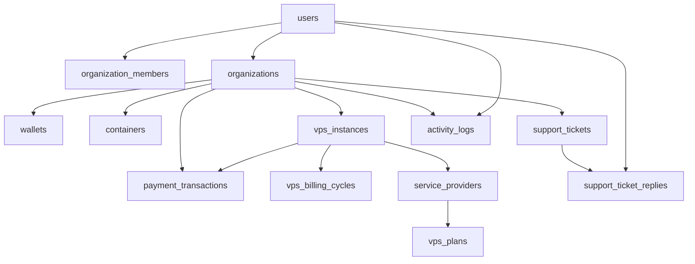

# Database Schema

ContainerStacks uses PostgreSQL with migrations stored in `migrations/`. The schema emphasises multi-tenancy (organizations), wallet-based billing, and infrastructure metadata. This document captures the current structure and relationships.

## Conventions

- Primary keys: UUIDs generated via `uuid_generate_v4()` (ensure the `uuid-ossp` extension is enabled).
- Timestamps: `created_at`/`updated_at` columns default to `NOW()` with triggers maintaining `updated_at`.
- JSON: many configuration fields use `JSONB` for flexibility.
- Row-level security is enabled for `user_api_keys` with a policy restricting rows to the current user (requires `app.current_user_id` to be set when using RLS).

## Core Identity & Organizations

| Table | Purpose | Key Columns |
| --- | --- | --- |
| `users` | Accounts, authentication, and profile metadata. | `email` (unique), `password_hash`, `name`, `role` (`admin` or `user`), `phone`, `timezone`, `preferences` (JSONB). |
| `organizations` | Tenancy boundary and billing owner. | `slug` (unique), `owner_id` → `users.id`, `settings` (JSONB), optional contact info. |
| `organization_members` | Membership join table with per-org roles. | `organization_id`, `user_id`, `role` (`owner`, `admin`, `member`). |
| `wallets` | Prepaid balance per organization. | `balance` (DECIMAL), `currency` (default USD). |
| `user_api_keys` | Personal API keys hashed and stored with prefix for display. | `key_name`, `key_hash`, `key_prefix`, `permissions` (JSONB), `active`, `expires_at`, `last_used_at`. |

## Containers

| Table | Purpose | Key Columns |
| --- | --- | --- |
| `containers` | Metadata for container deployments. | `organization_id`, `image`, `config` (JSONB), `status`, `created_by`. |
| `container_pricing_config` | Global container pricing calculation inputs. | Per-unit pricing for CPU, RAM, storage, network, `currency`. |
| `container_plans` | Predefined container plans. | `cpu_cores`, `ram_gb`, `storage_gb`, `network_mbps`, `base_price`, `markup_price`, `active`. |

## VPS & Providers

| Table | Purpose | Key Columns |
| --- | --- | --- |
| `vps_instances` | Locally cached representation of Linode instances. | `organization_id`, `plan_id`, `provider_instance_id` (string), `label`, `status`, `ip_address`, `configuration` (JSONB), `last_billed_at`. |
| `vps_plans` | Plans sold to customers, mapped to provider offerings. | `provider_id` (→ `service_providers`), `provider_plan_id`, `base_price`, `markup_price`, `specifications` (JSONB), `active`. |
| `service_providers` | External provider accounts (Linode, DO, AWS, GCP). | `name`, `type`, `api_key_encrypted`, `configuration` (JSONB), `active`. |
| `vps_stackscript_configs` | Admin-controlled metadata for StackScripts shown in the UI. | `stackscript_id` (PK), `label`, `description`, `is_enabled`, `display_order`, `metadata` (JSONB). |
| `networking_config` | Default networking options such as rDNS base domain. | `rdns_base_domain`. |

## Billing & Payments

| Table | Purpose | Key Columns |
| --- | --- | --- |
| `payment_transactions` | Ledger of wallet credits/debits and PayPal interactions. | `organization_id`, `amount`, `currency`, `payment_method`, `payment_provider`, `provider_transaction_id`, `status`, `description`, `metadata` (JSONB). |
| `vps_billing_cycles` | Hourly billing snapshots to prevent double charging. | `vps_instance_id`, `organization_id`, `billing_period_start/end`, `hourly_rate`, `total_amount`, `status`, `payment_transaction_id`, `metadata`. |

## Support & Activity

| Table | Purpose | Key Columns |
| --- | --- | --- |
| `support_tickets` | Organization-generated support requests. | `subject`, `message`, `priority`, `category`, `status`, `created_by`. |
| `support_ticket_replies` | Threaded responses on support tickets. | `ticket_id`, `user_id`, `message`, `is_staff_reply`. |
| `activity_logs` | Audit trail of user actions. | `user_id`, `organization_id`, `event_type`, `entity_type`, `entity_id`, `message`, `status`, `metadata`. |

## Triggers & Utility Functions

- `update_updated_at_column()` keeps `updated_at` fresh on tables including `users`, `organizations`, `wallets`, `user_api_keys`, `containers`, `vps_instances`, `support_tickets`, `vps_plans`, `payment_transactions`, `container_pricing_config`, `container_plans`, `service_providers`, `vps_billing_cycles`, `vps_stackscript_configs`, and `networking_config`.
- `activity_logs` creation ensures the `pgcrypto` extension for `gen_random_uuid()` is available; failures log warnings but do not halt requests.

## Seed Data

- Migration `001_initial_schema.sql` creates a default admin user (`admin@containerstacks.com`, password `admin123`) and organization for local setups.

## Migrations & Tooling

- `scripts/run-migration.js` applies all SQL migrations in lexical order, skips already-applied statements, and verifies resulting tables.
- Additional scripts (`apply-migration.js`, `apply-single-migration.js`, `clean-migration.js`, etc.) assist with targeted operations; review inline comments before use.

## Relationships Overview

> Mermaid diagrams render in GitHub and many Markdown viewers. If your viewer lacks Mermaid support, read the relationships textually: `users` tie to organizations both directly (ownership) and via `organization_members`, organizations own wallets/containers/VPS/support records, and billing tables reference both organizations and VPS instances.
